# java

## 开始

### 注意

1.Java源文件以，java为扩展名。源文件的基本组成部分是类(class)。
2.Java应用程序的执行入口是main0方法。它有固定的书写格式：
public static void main(String[]args){...)
3.Java语言严格区分大小写。
4.Java方法由一条条语句构成，每个语句以“；”结束。
5.大括号都是成对出现的，缺一不可。【习惯，先写{ }再写代码】
6.一个源文件中最多只能有一个public类。其它类的个数不限。
7.如果源文件包含一个public类，则文件名必须按该类名命名！
8.一个源文件中最多只能有一个public类。其它类的个数不限，也可以将main方法写在非
public类中，然后指定运行非public类，这样入口方法就是非public的main方法

### 转义字符

| \t   | 水平制表符 |
| ---- | ---------- |
| \n   | 换行符     |
| \\\  | 一个\      |
| \\"  | 一个"      |
| \\'  | 一个'      |
| \\r  | 一个回车   |

### 注释

用于注解说明解释程序的文字就是注释，注释提高了代码的==阅读性==（可读性）；注释
是一个程序员必须要具有的良好编程习惯。将自己的思想通过注释先整理出来，再用
代码去体现。

●单行注释：
基本格式
格式：//注释文字
●多行注释：
·基本格式
格试：/\*注释文字\*/
●使用细节:
1)被注释的文字，不会被JVM(Java虚拟机)解释执行
2)多行注释里面不允许有多行注释嵌套

文档注释

生成文档

```shell
javadoc -xx -yy path fileName.java 
```

### 代码规范

1.类、方法的注释，要以javadoc的方式来写。
2.非Java Docp的注释，往往是给代码的维护者看的，着重告述读者为什么这样写，
如何修改，注意什么问题等
3.使用==tab==操作，实现缩进，默认整体向右边移动，时候用==shift+tab==整体向左移
4.运算符和=两边习惯性各加一个空格。比如：2 + 4 * 5 + 345 - 89
5.源文件使用utf-8编码
6.行宽度不要超过80字符
7.代码编写分行风格和行尾风格

## 变量

> 变量有三个基本要素: 类型、名称、值

1.变量表示内存中的一个存储区域[不同的变量，类型不同，占用的空间大小不同，
比如：int4个字节，double就是8个字节
2.该区域有自己的名称[变量名]和类型[数据类型]
3.变量必须先声明，后使用，即有顺序
4.该区域的数据/值可以在同一类型范围内不断变化
5.变量在同一个作用域内不能重名
6.变量=变量名+值+数据类型

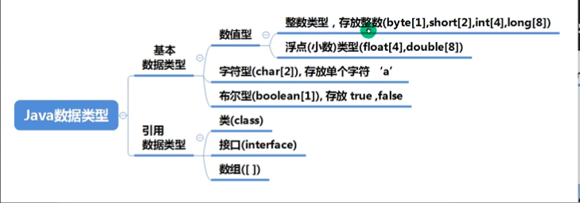

### 浮点

float 类型: 后面加 f 或 F

```java
float n1 = 1.1;  //错的
float n2 = 1.1f;
double n3 = 1.1;
double n4 = 1.1f;
```

推荐使用double

### char

1.字符常量是用==单引号==括起来的单个字符。例如：
char c1='a';

char c2='中'；

char c3='9';
2.Java中还允许使用转义字符来将其后的字符转变为特殊字符型常量。例如：

char c3='\n';  表示换行符
·3.在java中，char的==本质是一个整数==，在输出时，是unicode码对应的字符。
http://tool.chinaz.com/Tools/Unicode.aspx
4.可以直接给char赋一个整数，然后输出时，会按照对应的unicode字符输出[97]
5.char类型是可以进行运算的，相当于一个整数，因为它都对应有Unicode码.

### 自动类型转换

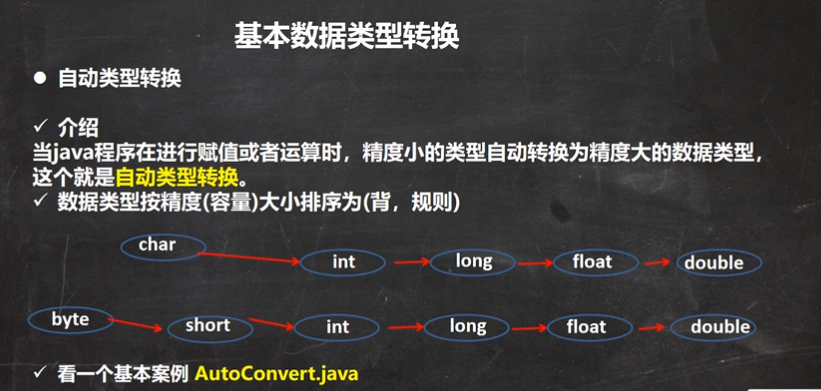

```java
int a = 'a';// 对的
double d = 80; // 对的
```

> 注意

1.有多种数据类型混合运算，自动将所有转化成最高的类型，再计算

```java
int n1 = 10;
float f1 = n1 + 1.1; // 错的
```

2.高精度赋值给低精度会报错，反之会转化

```java
int n1 = 1.1; // 错的
```

3.（byte,short）和 char 之间不会相互自动转化

```java
byte b = 10;
char c = b;  // 错的
```

4.byte，short，char三者之间可以运算，在计算时先转换为int

```java
byte b = 10;
short s = 11;
char c = 97;
int n = b + s + c;  // 只能用int以上来接收

//即是两个byte相加，也不能用byte接收,因为转化为了int
byte b1 = 10;
byte b2 = 20;
byte b3 = b1 + b2;  // 错的
int n = b1 + b2;    // 对的
```

5.boolean类型==不参与转换==

```java
boolean pass = true;
int n = pass;  // 错的
```

6.表达式的结果自动转化为操作数中最大的类型

### 强制类型转换

自动类型转换的逆过程，将容量大的数据类型转换为容量小的数据类型。
使用时要加上强制转换符()，但可能造成==精度降低或溢出==，格外要注意。

> 注意

1.当进行数据的大小从大一>小，就需要使用到强制转换
2.强转符号只针对于最近的操作数有效，往往会使用小括号提升优先级

```java
int x = (int)10 * 1.5;  // 错的
int y = (int)(10 * 1.5); // 对的
```

3.char类型可以保存int的常量值，但不能保存int的变量值，需要强转

```java
char c = 100;
int m = c;
char c1 = m; // 错误
```

4.byte和short,char类型在进行运算时，当做int类型处理。

练习

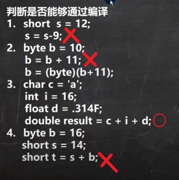

### 基本数据类型和String的转换

基本类型转String类型

语法: 将基本类型的值 + "" 即可

```java
int a = 100;
String s = a + "";
```

String转为基本数据类型

使用基本类型包装类

```java
String s = "123";
int n = Integer.parseInt(s);
double d = Double.parseDouble(s);
float f = Float.parseFloat(s);
long l = Long.parseLong(s);
```

> ==注意==
>
> 在将String类型转成基本数据类型时，==要确保String类型能够转成有效的数据==，比如
>
> 我们可以把"123”，转成一个整数，但是不能把"hello”转成一个整数
> 如果格式不正确，就会抛出异常，程序就会终止

## 运算符

### 算数运算符

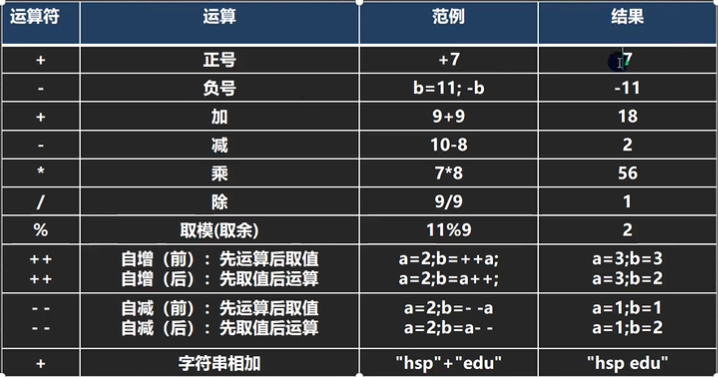

除法运算

```java
System.out.println(10 / 4);  // 2 舍弃了小数
System.out.println(10.0 / 4); // 2.5
double d = 10 / 4;
System.out.println(d);   // 2.0  计算出来还是2,转换为Double就为2.0
double dd = 10.0 / 4;
System.out.println(dd); // 2.5
```

取模运算

> 公式 a % b = a - a / b * b

自增

独立使用 前自增和后自增完全一样

```java
int i = 1;
i++;
++i;   // 
```

当作表达式

```java
int i = 10;
int k = ++i;   // k = 11
System.out.println(k);  // 11
k = i++;
System.out.println(k);  // 11
k = i;
System.out.println(k);  // 12
```

面试题

```java
int i = 1;
i = i++;
System.out.println(i); // 1
//三步
// temp = i;
// i = i + 1;
// i = temp;

int i = 1;
i = ++i;
System.out.println(i);  // 2
// 三步
// i = i + 1;
// temp = i;
// i = temp;
```

### 关系运算符

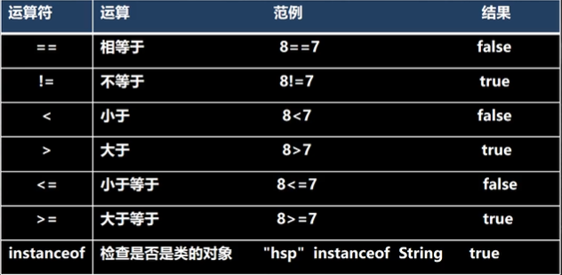

> 注意
>
> 1)关系运算符的结果都是boolean型，也就是要么是true,要么是false。
> 2)关系运算符组成的表达式，我们称为关系表达式。a > b
> 3)比较运算符”=="不能误写成"=”

### 逻辑运算符

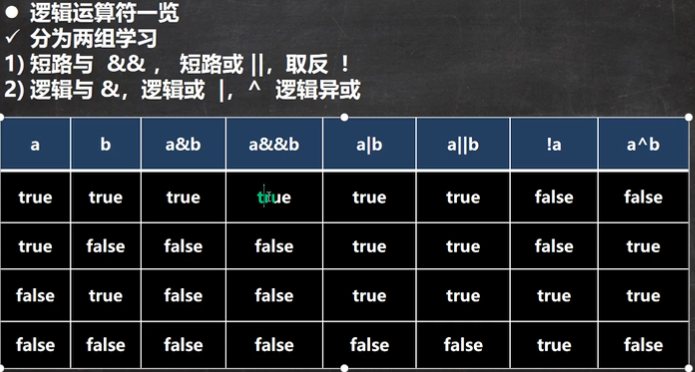

### 三元表达式

> 条件表达式？表达式1：表达式2；

运算规则：
1.如果条件表达式为true,运算后的结果是表达式1；
2.如果条件表达式为false,运算后的结果是表达式2；

> 表达式1 与 表达式2 要为可以赋值给接收变量的类型

```java
int a = 10;
int b = 20;
byte e = a > b ? (byte)a : (byte)b;
float c = a > b ? 10.1f : 20.1f;   // 对的
double d = a > b ? 1.1 : 2.2;      // 对的
```

### 运算优先级

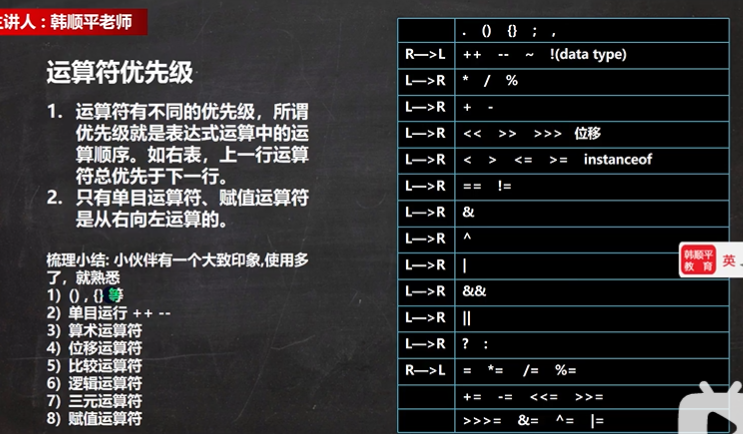

### 标识符

> ==注意==
>
> 1.由26个英文字母大小写，0-9，或$组成
> 2.数字不可以开头。int  3ab=1； /错误
> 3.不可以使用关键字和保留字，但能包含关键字和保留字。
> 4.Java中严格区分大小写，长度无限制。int totalNum=10;int n=90;
> 5.标识符不能包含空格。int a b=90;

> ==命名规范==
> 1.包名：多单词组成时所有字母都小写：aaa.bbb.ccc/比如com.hsp.crm
> 2.类名、接口名：多单词组成时，所有单词的首字母大写：XxxYyyZzz[大驼峰
> 比如：TankShotGame
> ,3.变量名、方法名：多单词组成时，第一个单词首字母小写，第二个单词开始每个
> 单词首字母大写：xxxYyyZzz[小驼峰，简称驼峰法]
> 比如：tankShotGame
> 4.常量名：所有字母都大写。多单词时每个单词用下划线连接：XXX YYY ZZZ
> 比如：定义一个所得税率TAX_RATE

### 键盘输入

使用Scanner

> 步骤
> 1)导入该类的所在包，java.util.*
> 2)创建该类对象（声明变量）
> 3)调用里面的功能

```java
import java.util.Scanner;
public class ScannerOperator {
    public static void main(String[] args){
        Scanner myScanner = new Scanner(System.in);
        System.out.println("请输入名字:");
        String name = myScanner.nextLine();
        System.out.println("你是" + name + "对吧")
    }
}
```

### 补码、反码、原码

> 1.二进制的最高位是符号位：0表示正数，1表示负数（老韩口诀：0->0 1->-）
> 2.正数的原码，反码，补码都一样（三码合一）
> 3.==负数的反码=它的原码符号位不变，其它位取反(0->1,1->0)==
> 4.==负数的补码=它的反码+1，负数的反码=负数的补码-1==
> 5.0的反码，补码都是0
> 6.java没有无符号数，换言之，java中的数都是有符号的
> 7.在计算机运算的时候，都是以补码的方式来运算的.
> 8.当我们看运算结果的时候，要看他的原码

> 3个位运算符>>、<<和>>>，运算规则：
> 1.算术右移>>：低位溢出，符号位不变，并用符号位补溢出的高位
> 2.算术左移<<：符号位不变，低位补0
> 3.>>>逻辑右移也叫无符号右移，运算规则是：低位溢出，高位补0
> 4.特别说明：没有<<<符号

## 数组、排序和查找

### 数组

> 数组可以存放多个同一类型的数据。数组也是一种数据类型，是引用类型。
> 即：数组就是一组数据

定义一个数组

方式1

```java
int[] arr = new int[5];
```

方式2----动态初始化

```java
int[] arr;   // 先声明
arr = new int[10];    // 然后初始化
```

方式3----静态初始化

如果知道数组有多少元素和具体值

```java
double[] arr = {1,2,3,4,5};
```

使用 for 循环遍历元素

使用下标[ ]访问元素，下标从 0 开始

```java
for(int i = 0; i < arr.length; i++){
    System.out.println(arr[i]);
}
```

> ==细节==
>
> 1.数组是多个相同类型数据的组合，实现对这些数据的统一管理
> 2.数组中的元素可以是任何数据类型，包括基本类型和引用类型，但是==不能混用==。
> 3.数组创建后，如果没有赋值，有默认值
> int 0,short 0,byte 0,long 0,float 0.0,double 0.0,
>
> char \u0000,boolean false,String null
> 4.使用数组的步骤
>
> ​	>> 1.声明数组并开辟空间
>
> ​	>>2给数组各个元素赋值
>
> ​	>>3使用数组
> 5.数组的下标是从0开始的。
> 6.数组下标必须在指定范围内使用，否则报：下标越界异常，比如
> int arr:=new int[5];      //则有效下标为0-4
> 7.数组属引用类型，数组型数据是对象(object)

### 二维数组

> ==注意==
>
> 1.一维数组的声明方式有：
> int[] x 或者  int x[]
> 2.二维数组的声明方式有：
> int\[]\[] 或者 int[] y[] 或者int y\[]\[]
>
> 3.二维数组实际上是由多个一维数组组成的，它的各个一维数组的长度可以相同， 也可以不相同。

练习

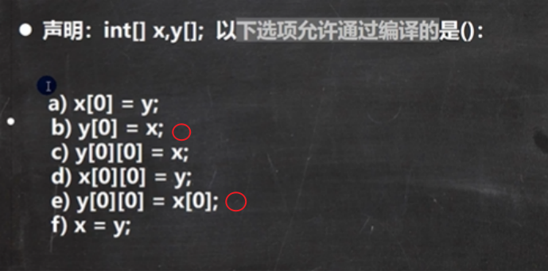

## 类与对象

对象在内存中的形式

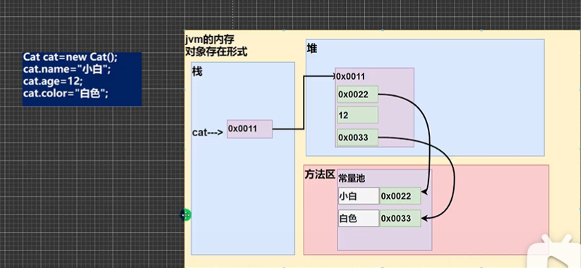

### 属性/成员变量

> 基本介绍
> 1.从概念或叫法上看：成损变量=属性=field(字段)（即成员变量是用来表示属性的)
> 2.属性是类的一个组成部分，一般是基本数据类型，也可是引用类型（对像，数组）。

### 类和对象

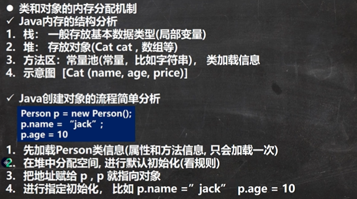

### 方法

在某些情况下，我们要需要定义成员方法（简称方法）。比如人类：除了有一些属性外（年龄，
姓名)，我们人类还有一些行为比如可以说话、跑步，通过学习，还可以做算术题。这时就
要用成员方法才能完成。

```java
class Person{
    String name;
    int age;
    
    public void speak(){
        System.out.println("我是个好人");
    }
    // (int n) 形参列表
    public void speak(int n){
        int res = 0;
        for(int i = 0; i < n; i++){
            res += i;
        }
        System.out.println("求和为" + res)
    }
    public int getSum(int num1, int num2){
        return num1 + num2;
    }
}
```


> √访问修饰符（作用是控制方法使用的范围）

如果不写默认访问，[有四种：public,protected,默认，private]

> √返回数据类型

1.一个方法最多有==一个==返回值
2.返回类型可以为任意类型，包含基本类型或引用类型（数组，对象）
3.如果方法要求有返回数据类型，则方法体中最后的执行语句必须为return值；而
且要求返回值类型必须和return的值类型一致或兼容
4.如果方法是void,则方法体中可以没有returnj语句，或者只写return:

> √方法名

遵循驼蜂命名法，最好==见名知义==，表达出该功能的意思即可，比如得到两个数的和
getSum

> √形参列表

1.一个方法可以有0个参数，也可以有多个参数，中间用逗号隔开，比如getSum(intn1,intn2)
2.参数类型可以为任意类型，包含基本类型或引用类型，比如printArr(int0map)
3.调用带参数的方法时，一定对应着参数列表传入相同类型或兼容类型的参数！【getSum】
4.方法定义时的参数称为形式参数，简称形参；方法调用时的参数称为实际参数，简称实参，实
参和形参的类型要一致或兼容、个数、顺序必须一致！
√方法体
里面写完成功能的具体的语句，可以为输入、输出、变量、运算、分支、循环、方法调用，但里
面==不能再定义方法==！即：方法不能嵌套定义。

> √方法调用细节说明

1.同一个类中的方法调用：直接调用即可。比如print(参数)：

```java
class A{
    public void print(int n){
        System.out.println("print()方法被调用 n=" + n);
    }
    
    public void sayOk(){
        print(10);
        System.out.println("okok");
    }
}
```

2.跨类中的方法A类调用B类方法：需要通过对象名调用。比如对象名.方法名（参
数)：案例演示：B类sayHello调用print()

```java
class B{
    public void sayHello(){
        A a = new A();
        a.print(10);   //    <===
    }
}
```

3.特别说明一下：跨类的方法调用和方法的访问修饰符相关.

### 递归

> ·递归重要规则
> 1.执行一个方法时，就创建一个新的受保护的独立空间（栈空间）
> 2.方法的局部变量是独立的，不会相互影响，比如变量
> 3.如果方法中使用的是引用类型变量（比如数组，对象），就会共享该引用类型的数据。
> 4.递归必须向退出递归的条件逼近，否则就是无限递归，出现
> StackOverflowError
> 5.当一个方法执行完毕，或者遇到return,就会返回，遵守谁调用，就将结果返回给谁，同时当方法执行完毕或者返回时，该方法也就执行完毕。

### 方法重载

> 基本介绍
> java中允许同一个类中，多个同名方法的存在，但要求==形参列表不一致==！

●重载的好处

1)减轻了起名的麻烦
2)减轻了记名的麻烦

> ==注意事项和使用细节==
> 1)方法名：必须相同
> 2)参数列表：必须不同（参数类型或个数如或顺序，至少有一样不同，参数名无要求）
> 3)返回类型：无要求

```java
class Calculator{
    public int calculate(int n1,int n2){
        return n1 + n2;
    }

    public double calculate(int n1,double n2){
        return n1 + n2;
    }

    public double calculate(double n1,int n2){
        return n1 + n2;
    }

    public int calculate(int n1,int n2,int n3){
        return n1 + n2 + n3;
    }
}
```

### 可变参数

> ·基本概念
> java允许将同一个类中多个同名同功能但参数个数不同的方法，封装成一个方法。

●基本语法
访问修饰符返回类型方法名（数据类型...形参名）{ }

```java
public class VarParams {
    public static void main(String[] args) {
        Method method = new Method();
        System.out.println(method.sum());    //  0
        System.out.println(method.sum(1,2,3));   // 6
    }
}

class Method{
    public int sum(int...numbs){  // 收集为数组
        int count = 0;
        for(int i = 0; i< numbs.length; i++){
            count += numbs[i];
        }
        return count;
    }
}
```

注意事项和使用细节

> 1)可变参数的实参可以为0个或任意多个。

```java
method.sum();
method.sum(1,2,3,4,5);
```

> 2)可变参数的实参可以为==数组==。

```java
public class VarParams {
    public static void main(String[] args) {
        Method method = new Method();
        int[] arr = {1,2,3,4,5};
        method.sum(arr);    // 传入数组
    }
}

class Method{
    public void sum(int...numbs){  // 收集为数组
        //...
    }
}
```

> 3)可变参数的本质就是数组.
> 4)可变参数可以和普通类型的参数一起放在形参列表，但必须保证==可变参数在最后==

```java
class Method{
    public void sum(String name,int...numbs){  // 放在末尾
        //...
    }
}
```

> 5)一个形参列表中==只能出现一个==可变参数

### 作用域

> 1.在java编程中，主要的变量就是属性（成员变量）和局部变量，
> 2.我们说的局部变量一般是指在成员方法中定义的变量。
> 3.java中作用域的分类
> 全局变量：也就是属性，作用域为整个类体.
>
> 局部变量：也就是除了属性之外的其他变量，作用域为定义它的代码块中！

```java
class Cat{
    String name;
    int age;   //  全局变量,哪里都可以用
    
    public void cry(){
        String koe = "喵~";   //局部变量,只能在这个方法中使用
        System.out.prinln("我是" + name + "," + koe);
    }
  
}
```

> 4.全局变量可以不赋值，直接使用，因为有默认值，==局部变量必须赋值后==，才能使
> 用，因为没有默认值。

==注意==

> 1.属性和局部变量可以重名，访问时遵循就近原则。

```java
class Cat{
    String name = "Yae";
    
    public void sayHi(){
        String name = "Miko";
        System.out.println("My name is " + name);  // My name is Miko
    }
}
```

> 2.在同一个作用域中，比如在同一个成员方法中，两个局部变量，不能重名。
> 3.属性生命周期较长，伴随着对象的创建而创建，伴随着对象的死亡而死亡。局部变
> 量，生命周期较短，伴随着它的代码块的执行而创建，伴随着代码块的结束而死亡。
> 即在一次方法调用过程中。
>
> 4.作用域范围不同
> 全局变量/属性：可以被本类使用，或其他类使用（通过对象调用）
> 局部变量：只能在本类中对应的方法中使用

```java
class Cat{
    String name = "Neko";
}

class Dog{
    public void test(){
        Cat c = new Cat();
        System.out.println("The cat's name is " + c.name); // The cat's name is Neko;
    }
    
    public void fight(Cat c){
        System.out.println("Dog fight with " + c.name); // Dog figth with Neko;
    }
}
```


> 5.修饰符不同
>
> 全局变量/属性可以加修饰符
> 局部变量不可以加修饰符

### 构造器

构造方法又叫构造器(constructor),是类的一种特殊的方法，它的主要作用是完成对新对象的初始化。

> > 对象已经有了，构造器做的只是初始化对象，而不是==创建对象==

基本语法

```java
public ClassName(){
    //...
}
```

> ==注意==
> 1.一个类可以定义多个不同的构造器，即构造器重载
> 比如：我们可以再给Person类定义一个构造器，用来创建对象的时候，只指定人名，不需要指定年龄

```java
class Person{
    String name;
    int age;
    
    public Person(String name,int age){
        //...
    }
    public Person(String name){
        //...
    }
}

public class MyConstructor{
    public static void main(String[] args){
        Person p1 = new Person("Yae");
        Perosn p2 = new Person("Ei",500);
    }
}
```

> 2.构造器名和类名要相同
> 3.构造器==没有返回值==
> 4.构造器是完成对象的初始化，==并不是创建对象==
> 5.在创建对象时，系统自动的调用该类的构造方法

> 6.如果程序员没有定义构造器，系统会自动给类生成一个==无参构造器==
>
> 7.一旦定义了自己的构造器，默认的构造器就覆盖了，就不能再使用默认的无
> 参构造器，除非==显式的定义一下==

```java
class Dog{
    String name;
    
    public Dog(){}  // 如果不写,默认的无参构造器就没有了
    
    public Dog(String name){
        //..
    }
}
```

对象初始化过程

[【零基础 快速学Java】韩顺平 零基础30天学会Java_哔哩哔哩_bilibili](https://www.bilibili.com/video/BV1fh411y7R8?p=245&spm_id_from=pageDriver)

第==245==节

```java
class Person{
    // 类Person
    String name;
    int age = 90;
    public Person(String n,int a){
        name = n;
        age =  a;
    }
}

Person p = new Person("Yae",500);
```

流程分析（面试题）
1.加载Person类信息(Person.class),只会加载一次
2.在堆中分配空间（地址）
3.完成对象初始化

​	3.1默认初始化age=0; name=null

​	3.2显式初始化age=90;name=null

​	3.3构造器的初始化age=20,name=Yae
4.对象在堆中的地址，返回给p(p是对象名，也可以理解成是对象的引用)

### this关键字

```java
class Cat{
    String name;
    int age;
    
    public Cat(String name,int age){
        this.name = name;
        this.age = age;
    }
}
```

细节

> 1.this关键字可以用来访问本类的属性、方法、构造器

```java
class T{
    public void f1(){
        System.out.println("this is f1...");
    }
    public void f2(){
        System.out.println("this is f2...");
        // 调用f1的两种方式
        f1();
        this.f1();
    }
}
```

> 2.this用于区分当前类的属性和局部变量
> 3.访问成员方法的语法：ths.方法名（参数列表）：
> 4.访问构造器语法：ths(参数列表)：==注意只能在构造器中使用==

```java
class T{
    String name;
    int age;
    public T(){
        this("Yae",12);   // 如果有this访问构造器的语法，必须放在第一行
        System.out.println("this is the constructor 1.")
    }
    
    public T(String name,int age){
        this.name = name;
        this.age= age;
        System.out.println("this is the constructor 2.")
    }
}

T t = new T();
// this is the constructoe 2.
// this is the constructor 1.
```

> 5.ths不能在类定义的外部使用，只能在类定义的方法中使用。

练习

定义Person类
里面有name、age属性，并提供compareTo比较方法，用于判断是否和另一个人相等，提供测试类TestPerson用于测试，名字和年龄完全一样，就返回true,否则返回false

```java
class Person{
    String name;
    int age;
    public Person(){}
    public Person(String name,int age){
        this.name = name;
        this.age = age;
    }
    public boolean compareTo(Person p){
        return this.name.equals(p.name) && p.age == this.age;
    }
}

public class TestPerson{
    public static void main(String[] args){
        Person p1 = new Person("Yae",500);
        Person p2 = new Person();
        System.out.println(p1.compareTo(p2));   // false;
        p2.name = "Yae";
        p2.age = 500;
        System.out.println(p1.compareTo(p2));   // true;
    }
}
```

# 面向对象中级

## IDEA

### 快捷键

> 1.删除当前行，默认是==ctrl+d==
> 2.复制当前行，自己配置ctrl+at+向下光标
> 3.补全代码==alt+/==
> 4.添加注释和取消注释==ctrl+/==【第一次是添加注释，第二次是取消注释】
>
> 5.快速导入类 先配置 auto import ，然后使用 ==alt + enter==
>
> 6.快速格式化 ==ctrl + alt + R==
>
> 7.快速运行 ==ctrl + R==
>
> 8.生成构造器 ==alt + insert==
>
> 9.查看类的层级 ==ctrl + H==
>
> 10.光标放在方法上，使用==ctrl+B==，快速定位到方法
>
> 11.自动分配变量名，在后面加 ==.var==
>
> 12.更多 。。。

### 模板

file->settings ->editor->Live templates -
查看有哪些模板快捷键/可以自己==增加模板==

### 包

> 包的命名

√命名规则：
只能包含数字、字母、下划线、小圆点，但不能用数字开头，不能是关键字或保留字

```java
demo.class.exec1    // 错误 包含class
demo.12a            // 错误 数字开头
demo.ab12.oa       // 正确
```

√命名规范
一般是小写字母+小圆点
一般是com.公司名.项目名.业务模块名
比如：

com.hspedu.oa.model;

com.hspedu.oa.controller;
举例：
com.sina.crm.user/用户模块
com.sina.crm.order/订单模块
com.sina.crm.utils/工具类

> 常用的包

一个包下，包含很多的类，java中常用的包有：
java.lang.*
//lang包是基本包，默认引入，不需要再入.
java.util.*
//util包，系统提供的工具包，工具类，使用Scanner
java.net.*
//网络包，网络开发
java.awt.*
//是做ava的界面开发，GUI

> 引入包

语法：import包；
我们引入一个包的主要目的是要使用该包下的类
比如import java.util.Scanner;就只是引入一个类Scanner。
import java.util.*:/表示将java.util包所有都引入

> 注意事项和使用细节

1.package的作用是声明当前类所在的包，
需要放在==类的最上面==，一个类中最多==只有一句==package
2.import指令位置放在package的下面，在类定义前面，可以有多句且没有顺序要求。

## 面向对象

### 访问修饰符

java提供四种访问控制修饰符号，用于控制方法和属性（成员变量）的访问权限（范围）
1.公开级别：用==public==修饰，对外公开
2.受保护级别：用==protected==修饰，对子类和同一个包中的类公开
3.默认级别：没有修饰符号，向同一个包的类公开
4.私有级别：用==private==修饰，只有类本身可以访问，不对外公开

范围

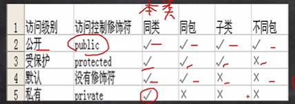

只有==默认==和==public==才能修饰类

### 封装

如果有不允许随意修改的值

```java
class Person{
    public String name;
    private int age;
    
    public void setAge(int age){
        if(age > 1 %% age < 120){
            this.age = age;
        }else{
            System.out.println("错误的年龄(1-120)");
            this.age = 18;
        }
    }
    public int getAge(){
        return this.age;
    }
    
}
```

配合构造器，可以将set写在构造器中

```java
class Person{
    //...
    public Person(String name;int age){
        setAge(age);
        this.name = name;
    }
    //...
}
```

### 继承

继承可以解决代码复用，让我们的编程更加靠近人类思维，当多个类存在相同的属性（变量）
和方法时，可以从这些类中抽象出父类，在父类中定义这些相同的属性和方法，所有的子
类不需要重新定义这些属性和方法，只需要通过extends来声明继承父类即可。

●继承的基本语法
```java
class Dog extends Animal{
    //...
}
```

1)子类就会自动拥有父类定义的属性和方法
2)父类又叫超类，基类。
3)子类又叫派生类。

细节

> 1.子类继承了所有的属性和方法，但是私有属性不能在子类直接访问，要通过==公共的方法==去访问
>
> 非私有的属性和方法可以访问

```java
public class Base{
    private String name;
    
    public  String getName(){
        return this.name;
    }
}
//...

public class Sub extends Base{
    
    public void show(){
        //System.out.println(name);   // 错的
        System.out.println(getName())
    }
}
```

> 2.子类必须调用父类的构造器，完成父类的初始化

在子类构造器的第一行，会默认调用一个super( )

```java
class Cat extends Animal{
    public Cat(){
        //super();   这是默认的
    }
    //...
}
```


> 3.当创建子类对象时，不管使用子类的哪个构造器，默认情况下==总会去调用父类的无参构造器==，如果父类没有提供无参构造器，则==必须在子类的构造器中用super去指定==使用父类的哪个构造器完成对父类的初始化工作，否则，编译不会通过

```java
class Animal{
    String name;
    
    // public Animal(){}
    public Animal(String name){
        this.name = nane;
    }
    //...
}

class Cat extends Animal{
    int age;
    
    public Cat(){
        super("Mimi");   // 因为父类没有无参构造器,所以要手动指定
    }
    
    public Cat(int age){
        super("Mimi");    // 当然,这里也需要指定
        this.age = age;
    }
}
```

> 4.如果希望指定去调用父类的某个构造器，则显式的调用一下  super(参数列表)
> 5.super在使用时，需要放在==构造器第一行==
> 6.super( )和thi( )都只能放在构造器第一行，因此这两个方法==不能共存==在一个构造器

> 7.java所有类都是Object类的子类，Object是所有类的基类.

> 8.父类构造器的调用不仅限于直接父类.将一直追溯直到Object类

> 9.子类最多只能继承一个父类（指直接继承），即java中是单继承机制。

> 10.不能滥用继承，子类和父类之间必须满足is-a的逻辑关系

```markdown
Person is a Music?
Person Music
Music extends Person  // 不合理

Animal
Cat extends Animal   // 合理
```

==创建一个继承对象时，发生了什么==

[【零基础 快速学Java】韩顺平 零基础30天学会Java_哔哩哔哩_bilibili](https://www.bilibili.com/video/BV1fh411y7R8?p=294&spm_id_from=pageDriver)==P293==

创建对象时，沿着==继承链从上往下==调用构造方法

```java
public class ExtendsTheory{
    public static void main(String[] args){
        Son son = new Son();
        System.out.println(son.age)   // 40
        // 这时，要按照查找关系返回信息
        // (1) 首先查看子类是否有该属性
        // (2) 如果子类有这个属性，并且可以访问，则返回信息
        // (3) 如果子类没有这个属性，就看父类有没有这个属性（如果父类有该属性，并且可以访问，则返会信息)
        //(4) 如果父类没有这个属性，再按（3）的逻辑找，直到找到为止
    }
}
    
class GrandPa{
    String name = "Pappy";
    String hobby = "Dancing";
}

class Father extends GrandPa{
    String name = "Daddy";
    int age = 40;
}

class Son extends Father{
    String name = "Baby";
}
    
```

==如果子类有这个属性，但是为私有属性，会报错==

练习

```java
class A{
    public A(){
        System.out.println("a");
    }
    public A(String name){
        System.out.println("a name");
    }
}

class B extends A{
    public B(){
        this("Yae");
        System.out.println("b");
    }
    public B(String name){
        System.out.println("b name");
    }
}

public class Demo{
    public static void main(String[] args){
        B b = new B();
    }
}
```

输出：

```java
// a
// b name
// b
```

过程：

调用B类的无参构造方法

this("Yae") 指定B类的带参构造方法

B类的带参构造方法 第一行省略了 super(   )，随机调用 A类的无参构造方法   ==>   a

B类的带参构造方法继续执行   ==>  b name

B类的无参构造方法继续执行  ==>   b

### super

> 基本介绍

super代表==父类的引用==，用于访问父类的属性、方法、构造器

> 基本语法

1.访问父类的属性，但不能访问父类的private属性
super.属性名；
2.访问父类的方法，不能访问父类的private方法
super.方法名（参数列表）
3.访问父类的构造器：
super(参数列表)：只能放在==构造器的第一句==，只能==出现一句==！

> 细节

1.调用父类的构造器的好处
(分工明确，父类属性由父类初始化，子类的属性由子类初始化)
2.当子类中有和父类中的成员（属性和方法）==重名==时，为了访问父类的成员，必须通过super。如果没有重名，使用super、.this、直接访问是一样的效果！

3.super的访问不限于直接父类，如果爷爷类和本类中有同名的成员，也可以使用super去访问爷爷类的成员；如果多个基类(上级类)中都有同名的成员，使用super访问遵循就近原则。A->B->C

> super和this

| No.  | 区别点     | this                                                   | super                                    |
| ---- | ---------- | ------------------------------------------------------ | ---------------------------------------- |
| 1    | 访问属性   | 访问本类中的属性，如果本类没有此属性则从父类中继续查找 | 从父类开始查找属性                       |
| 2    | 调用方法   | 访问本类中的方法，如果本类没有此方法则从父类继续查找.  | 从父类开始查找方法                       |
| 3    | 调用构造器 | 调用本类构造器，必须放在子类构造器的首行               | 调用父类构造器，必须放在子类构造器的首行 |
| 4    | 特殊       | 表示当前对象                                           | 子类中访问父类对象                       |

### 方法重写(override)

简单的说：方法覆盖（重写）就是子类有一个方法，和父类的某个方法的==名称、返回类型、参数一样==，那么我们说子类的这个方法覆盖了父类的那个方法(也可能是爷爷的方法)

注意

> 1.子类的方法的==参数，方法名称==，要和父类方法的参数，方法名称完全一样。
> 2.子类方法的返回类型和父类方法==返回类型一样==，或者是==父类返回类型的子类==比如父类返回类型是Object,子类方法返回类型是String

```java
class Father{
    public Object show(){
        return null;
    }
}

class Son extends Father{
    public String show(){
        return "hello world";
    }
}
```

> 3.子类方法不能缩小父类的访问权限，可以放大

```java
class Father{
    protected void show(){}
}

class Son extends Father{
   //private void show(){}  //   错的，缩小了访问权限
    public void show(){}    //   对的，可以放大权限
}
```

> 重载和重写

| 名称           | 发生范围 | 方法名   | 形参列表                         | 返回类型                                                   | 修饰符                             |
| -------------- | -------- | -------- | -------------------------------- | ---------------------------------------------------------- | ---------------------------------- |
| 重载(overload) | 本类     | 必须一样 | 类型，个数或者顺序至少有一个不同 | 无要求                                                     | 无要求                             |
| 重写(override) | 父子类   | 必须一样 | 相同                             | 子类重写的方法返回的类型和父类的返回类型一样，或者是其子类 | 子类方法不能缩小父类方法的访问权限 |

### 多态

方法或对象具有多种形态。是面向对像的第三大特征，多态是建立在封装和继承基础
之上的。

> 1.方法的多态

```java
class Tools{
    public int sum(int n1,int n2){
        reutrn n1 + n2;
    }
    public int sum(int n1.int n2.int n3){
        return n1 +n2 + n3;
    }// 相同的方法名，根据参数的不同，调用不同的方法，体现了多态
}

class Tool1 extends Tools{
    public int sum(int n1,int n2){
        return n1 + n2 + 100;
    }
}

class Tool2 extends Tools{
    public int sum(int n1,int n2){
        return n1 + n2 + 1000;
    }
}

public class Polymorphic{
    public static void main(Strin[] args){
        Tool1 t1 = new Tool1();
        Tool2 t2 = new Tool2();
        t1.sum(1,2);   // 112
        t1.sum(1,2);   //1012
        // 不同的类调用相同的方法，体现多态
    }
}
```

> 2.对象的多态==（核心，因难，重点）==

(1)一个对象的编译类型和运行类型可以不一致
(2)编译类型在定义对象时，就确定了，不能改变

```java
Animal animal = new Animal();   // animal 的编译类型就是Animal 不能改变
```

(3)运行类型是可以变化的

```java
animal = new Cat();    // animal 的运行类型变为了Cat，编译类型还是Animal
```

(4)编译类型==看定义时=号的左边==，运行类型==看=号的右边==

√多态的前提是：两个对象（类）存在==继承关系==

> 多态的向上转型

1)本质：父类的引用指向了子类的对象
2)语法：父类类型    引用名   =    new  子类类型(  )
3)特点：编译类型看左边，运行类型看右边。
可以调用父类中的所有成员（需遵守访问权限），不能调用子类中特有成员；最终==运行效果看子类==的具体实现！如果子类有，就调用，没有就往父类身上找

```java
class Animal{
    public void cry(){
        System.out.println("动物叫~~");
    }
}

class Cat extends Animal{
	public void catchMouse(){
        System.out.println("猫捉老鼠~~");
    }
}

public class Demo{
    public static void main(String[] args){
        Animal animal = new Cat();
        animal.cry();   // 动物叫~~
        // 编译看左边，能调用那些成员，看编译类型
       // animal.catchMouse();   // 报错
    }
}
```

> 多态的向下转型

1)语法：子类类型引用名  =（子类类型） 父类引用：
2)只能强转父类的引用，不能强转父类的对像
3)要求父类的引用必须指向的是当前目标类型的对象
4)可以调用子类类型中所有的成员

```java
class Animal{
    public void cry(){
        System.out.println("动物叫~~");
    }
}

class Cat extends Animal{
	public void catchMouse(){
        System.out.println("猫捉老鼠~~");
    }
}

public class Demo{
    public static void main(String[] args){
        Animal animal = new Cat();
        
        Cat cat = (Cat) animal;
        // animal 之前是Cat，所以可以转成 cat
       	cat.catchMouse();   // 猫捉老鼠
    }
}
```

> instanceOf 比较操作符，判断==对象的运行类型==是否为XX类型或XX类型的子类型

```java
class A{}
class B extends A{}
class Demo{
    A a = new B();
    System.out.println(a instanceOf B);  // true
    System.out.println(a instanceOf A);  // true
}
```

==属性看编译类型，方法看运行类型==

> 动态绑定==非常重要==

1.当调用对象方法的时候，该方法会和该对象的内存地址/运行类型绑定
2.当调用对象属性时，没有动态绑定机制，==哪里声明，那里使用==

[【零基础 快速学Java】韩顺平 零基础30天学会Java_哔哩哔哩_bilibili](https://www.bilibili.com/video/BV1fh411y7R8?p=315&spm_id_from=pageDriver)P315

## Object类

> equals(  ) 方法

==和equals(  ) 的对比

1.==：

既可以判断基本类型，又可以判断引用类型
如果判断基本类型，判断的是值是否相等。

```java
int i =10;
double d = 10.0;
i == d;  // true
```

如果判断引用类型，判断的是地址是否相等，即判定是不是同一个对象

```java
A a = new A();
b = a;
c = b;
a == b;  // true;
a == c;  // true;
```

2.equals 方法

equals是Object类中的方法，只能判断引用类型
默认判断的是==地址是否相等==，子类中往往重写该方法，用于判断内容是否相等。比如Integer,String

Object的原码，判断两个对象是不是同一个对象

```java
 public boolean equals(Object obj) {
        return (this == obj);
    }
```

String的原码，重写了equals方法，比较值是否相等

```java
public boolean equals(Object anObject) {
        if (this == anObject) {
            return true;
        }
        if (anObject instanceof String) {
            String aString = (String)anObject;
            if (coder() == aString.coder()) {
                return isLatin1() ? StringLatin1.equals(value, aString.value)
                                  : StringUTF16.equals(value, aString.value);
            }
        }
        return false;
    }
```

### hashCode

1)提高具有哈希结构的容器的效率！
2)两个引用，如果指向的是同一个对象，则哈希值肯定是一样的！
3)两个引用，如果指向的是不同对象，则哈希值是不一样的
4)哈希值主要根据地址号来的！==不能完全==将哈希值等价于地址。

### toString 方法

```java
public String toString() {
        return getClass().getName() + "@" + Integer.toHexString(hashCode());
    }
// getClass().getName()   返回全类名
// Integer.toHexString(hashCode()) 将hashcode转换成16进制字符串
```

重写toString方法，打印对象或拼接对象时，都会自动调用该对象的toString形式.
```java
@Override
public String toString() {
    return "Person{" +
            "name='" + name + '\'' +
            ", age=" + age +
            ", gender=" + gender +
            '}';
}
```

当直接输出一个对象时，toString方法会被默认的调用，比如
```java
System.out.println(person);
System.out.println(person.toString());  // 等价
```

### finalize

1.当对象被回收时，系统自动调用该对象的finalize方法。子类可以重写该方法，做一些释放资源的操作
2.什么时候被回收：当某个对象没有任何引用时，则就认为这个对象是一个垃·圾对象，就会使用垃圾回收机制来销毁该对象，在销毁该对象前，会先调用finalize方法。
3.垃圾回收机制的调用，是由系统来决定，也可以通过System.gc( )主动触发垃圾回收机制

```java
Car bmw = new Car("BMW");
bwm = null;
//这时car对象就是一个垃圾，垃圾回收器就会回收（销毁）对象，在销毁对象前，会调用该对象的finalize方法
//,程序员就可以在finalize中，写自己的业务逻辑代码（比如释放资源：数据库连接，或者打开文件，，）
//,如果程序员不重写finalize,那么就会调用Object类的finalize,即默认处理
//,如果程序员重写了finalize,就可以实现自己的逻辑
@Override
protected void finalize() throws Throwable {
    System.out.println("我走啦");
    super.finalize();
}
```

实际开发几乎不用

### 断点调试

> 在断点调试过程中，是==运行状态==，是以对象的==运行类型==来执行的

快捷键
F7:跳入方法内
F8:逐行执行代码.
shift+F8:跳出方法

F9(resume,执行到下一个断点)

## 面向对象高级

### 静态变量(类变量)

类变量是随着类的加载而创建的

1.什么时候需要用类变量
当我们需要让某个类的所有对象都==共享一个变量==时，就可以考虑使用类变量（静态变量)：比如：定义学生类，统计所有学生共交多少钱。
2.类变量与实例变量（普通属性）区别

类变量是该类的==所有对象共享==的，而实例变量是==每个对象独享==的。
3.加上statici称为类变量或静态变量，否则称为实例变量/普通变量/非静态变量
4.类变量可以通过类名，类变量名或者对象名.类变量名来访问，但java设计者推荐我们使用类名.类变量名方式访问。【前提是满足访问修饰符的访问权限和范围】

```java
class A{
    public static int age;
}

public class Test{
    public static void main(String[] args){
        System.out.println(A.age);  //  推荐
        A a = new A();
        System.out.println(a.age);   // 也可以 
    }
}
```


5.实例变量不能通过类名类变量名方式访问。
6.类变量是在类加戴时就初始化了，也就是说，
即使你没有创建对象，只要类加载了，
就可以使用类变量了。
7.类变量的生命周期是随类的加载开始，随着类消亡而销毁。

## 静态方法

类方法经典的使用场景

当方法中==不涉及到任何和对象相关的成员==，则可以将方法设计成静态方法，提高开发效率。
比如：工具类中的方法utils
Math类、Arrays类、Collections集合类看下源码：
小结
在程序员实际开发，往往会将一些通用的方法，设计成静态方法，这样我们不需要创建对象就可以使用了，比如打印一维数组，冒泡排序，完成某个计算任务等

> 注意
>
> 1)类方法和普通方法都是随着类的加载而加载，将结构信息存储在方法区：
> 类方法中==无this==的参数
> 普通方法中==隐含着this==的参数
> 2)类方法可以通过类名调用，也可以通过对象名调用。
> 3)普通方法和对象有关，需要通过对象名调用，比如对象名方法名（参数），不能通过类名调
> 用。
>
> 4)类方法中不允许使用和对象有关的关键字，比如this和super。普通方法（成员方法）可以。
> 5)类方法（静态方法）中只能访问静态变量回或静态方法
> 6)普通成员方法，既可以访问普通变量（方法），也可以访问静态变量（方法）

> 小结：静态方法，只能访问静态的成员，非静态的方法，可以访问静态成员和非静态成员
> (必须遵守访问权限)

### main(  )方法

解释main方法的形式：

```java
public static void main(String[] args){}
```

1.main方法时==虚拟机==调用
2.java虚拟机需要调用类的main()方法，所以该方法的访问权限必须是public
3.java虚拟机在执行main()方法时不必创建对象，所以该方法必须是static
4该方法接收String类型的数组参数，该数组中保存执行java命令时传递给所运行的类的参数 
5.java执行的程序  参数1  参数2   参数3

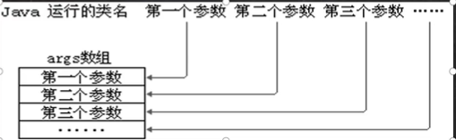

> 1)在main()方法中，我们可以直接调用main方法所在类的静态方法或静态属性。

```java
public class Main01{
    public static void main(String[] args){
        System.out.println(name);
        fn();
    }
    
    public static String name = "Yae";   // 可以访问
    
    public static void fn(){};    // 可以访问
}

```

> 2)但是，不能直接访问该类中的非静态成员，必须创建该类的一个实例对象后，才能
> 通过这个对象去访问类中的非静态成员，

```java
public class Main02 {
    public static void main(String[] args) {
        System.out.println(new Main02().name);
        new Main02().fn();
    }

    public String name = "Yae";  // 不能直接使用

    public void fn(){}    // 不能直接使用
}

```

### 代码块

基本介绍
代码化块又称为初始化块，属于类中的成员==[即是类的一部分==]，类似于方法，将逻辑语句封装在方法体中，通过{ }包围起来。
但和方法不同，没有方法名，没有返回，没有参数，只有方法体，而且不用通过对象或类显式调用，而是加载类时，或创建对象时隐式调用。
·基本语法

```markdown
修饰符{
	代码
}
```

注意：

1) 修饰符可选，要写的话，也只能写static

2) 代码块分为两类，使用static修饰的叫静态代码块，没有static修饰的，叫普通代码块。

3) 逻辑语句可以为任何逻辑语句（输入、输出、方法调用、循环、判断等）

4) ；号可以写上，也可以省略。

老师理解：
1)相当于另外一种形式的构造器（对构造器的补充机制），可以做初始化的操作
2)场景：如果多个构造器中都有重复的语句，可以抽取到初始化块中，提高代码的重用
性

细节

1)static代码块也叫静态代码块，作用就是对类进行初始化，而且它随着类的加载而执行，并且
==只会执行一次==。如果是普通代码块，每创建一个对象，就执行。

2)类什么时候被加载==重要！==
①创建对象实例时(new)
②创建子类对象实例，父类也会被加载
③使用类的静态成员时（静态属性，静态方法）

3)普通的代码块，在创建对象实例时，会被隐式的调用。被创建一次，就会调用一次。
如果只是使用类的静态成员时，普通代码块并不会执行。

4)创建一个对象时，在一个类调用顺序是：==(重点，难点）==
①调用静态代码块和静态属性初始化（注意：静态代码块和静态属性初始化调用的优先级一样，如果有多个静态代码块和多个静态变量初始化，则按他们定义的顺序调用)
②调用普通代码块和普通属性的初始化（注意：普通代码块和普通属性初始化调用的优先级一样，如果有多个普通代码块和多个普通属性初始化，则按定义顺序调用)
③调用构造方法。

5)构造器的最前面其实隐含了super()和调用普通代码块，说明，静态相关的代码块，属性初始化，在类加载时，就执行完毕,因此是优先于构造器和普通代码块执行的

6)我们看一下创建一个子类对象时（继承关系），他们的静态代码块，静态属性初始化，普通代码块，普通属性初始化，构造方法的调用顺序如下：
①父类的静态代码块和静态属性（优先级一样，按定义顺序执行）
②子类的静态代码块和静态属性（优先级一样，按定义顺序执行）
③父类的普通代码块和普通属性初始化（优先级一样，按定义顺序执行）
④父类的构造方法
⑤子类的普通代码块和普通属性初始化（优先级一样，按定义顺序执行）
⑥子类的构造方法

> 因为类加载是在初始化之前，而类的加载与静态代码块和静态属性相关，所以先加载父类的静态代码块和静态属性
>
> 然后回到子类，加载子类的静态代码块和静态属性
>
> 此时开始初始化。。。
>
> 先初始化父类的代码块的普通属性，之后调用构造器
>
> 然后是子类

[【零基础 快速学Java】韩顺平 零基础30天学会Java_哔哩哔哩_bilibili](https://www.bilibili.com/video/BV1fh411y7R8?p=390&spm_id_from=pageDriver)

7)静态代码块只能直接调用静态成员（静态属性和静态方法），普通代码块可以调
用任意成员。

练习

```java
class Person{
    public static int total;
    static{
        total = 100;
        System.out.println("in static block");
    }
}

public class Test{
    public static void main(String[] args){
        System.out.println("total=" + Person.total);
        System.out.println("total=" + Person.total);
    }
}
```

答案：

in static block

100

100

在访问类的静态成员时，Person类被加载，static 代码块被执行，static int 被修改为 100

之后打印 in static block   ---- 1

访问 total 值为   100      -------2

再次访问静态成员total，Person类被再一次加载，但是 static 代码块不再执行

直接输出  total  = 100     ------3

### 单例模式

·什么是单例模式
单例（单个的实例）
1.所谓类的单例设计模式，就是采取一定的方法保证在整个的软件系统中，对某个类==只能存在一个对象实例==，并且该类只提供一个取得其对象实例的方法
2.单例模式有两种方式：     2)懒汉式

1) 饿汉式 ----不管要不要用，先创建了再说

   1.将构造器私有
   2.在类的内部创建对象(该对象时static)
   3.提供一个公共的static方法返回对象

```java
public class SingleTon01 {
    public static void main(String[] args) {
        GirlFriend instance = GirlFriend.getInstance();
        GirlFriend instance1 = GirlFriend.getInstance();
        System.out.println(instance == instance1);    // true
    }
}


class GirlFriend {
    private String name;
    private static GirlFriend gf = new GirlFriend("Yae");// 因为 静态属性只加载一次

    private GirlFriend(String name) {
        this.name = name;
    }

    public static GirlFriend getInstance() {
        return gf;
    }
}
```

2.懒汉式

  	1.仍然构造器私有化

​	 2.定义一个static静态属性对象

​    3.提供一个public的static方法，可以返回一个对象

​    4.懒汉式，只有当使用getInstance时，才会返回对象，后面再次调用时，返回之前创建的对象

```java
public class SingleTon02 {
    public static void main(String[] args) {
        Cat instance = Cat.getInstance();
        Cat instance1 = Cat.getInstance();
   
        System.out.println(instance == instance1);
    }
}

class Cat{
    private String name;
    private static Cat cat;

    private Cat(String name){
        this.name = name;
    }

    public static Cat getInstance(){
        if(cat == null){
           cat = new Cat("小猫咪");
        }
        return cat;
    }
}

```

1.二者最主要的区别在于创建对象的==时机==不同：

饿汉式是在类加载就创建了对象实例，

而懒汉式是在使用时才创建。

2.饿汉式不存在线程安全问题，
懒汉式存在线程安全问题。

3.饿汉式存在浪费资源的可能。
因为如果程序员一个对象实例都没有使用，那么饿汉式创建的对象就浪费了，

懒汉式是使用时才创建，就不存在这个问题。
4.在我们javaSE标准类中，java.lang.Runtime  就是经典的单例模式。

### final关键字

final中文意思：最后的，最终的.
final可以修饰==类、属性、方法和局部变量==.
在某些情况下，程序员可能有以下需求，就会使用到final:

1)当不希望类被继承时，可以用fina修饰.

```java
final class A{}

class B extends A{}  // 无法继承
```

2)当不希望父类的某个方法被子类覆盖/重写(override)时，可以用final关键字
修饰。

```java
 class A{
    final public void fn(){}
 }

class B extends A{
    public void fn(){}    // 无法重写
}
```

3)当不希望类的的某个属性的值被修改，可以用final修饰.

```java
class A{
    final public double TAX_RATE = 0.08;
 }
```

4)当不希望某个局部变量被修改，可以使用final修饰

```java
 class A{
    public void change(){
        final int NUM = 10;
       // NUM = 100;   无法修改，也被成为局部常量
    }
 }
```

> 注意
>
> 1)final修饰的属性又叫常量，一般用XXXXXX来命名 (大写)
> 2)final修饰的属性在定义时，==必须赋初值==，并且以后不能再修改，赋值可以在如
> 下位置之一【选择一个位置赋初值即可】：
> ①定义时：如public final double TAX_RATE=O.O8;
> ②在构造器中
> ③在代码块中。
> 3)如果final修饰的属性是静态的，则初始化的位置只能是
> ①定义时
>
> ②在静态代码块
>
> 不能在构造器中赋值。
> 4)final类不能继承，但是可以实例化对象。
> 5)如果类不是final类，但是含有final方法，则该方法虽然不能重写，但是可以被继承。
>
> 5)一般来说，如果一个类已经是final类了，就==没有必要==再将方法修饰成final方法。
> 6)final==不能修饰构造方法==（即构造器）
> 7)final和static往往搭配使用，效率更高，==不会导致类加载==，底层编译器做了优化处理。

```java
public class Final01 {
    public static void main(String[] args) {
        System.out.println(A.n1);   // 10  在这里不会加载类
        System.out.println(A.n2);   // 加载类~ 
        							//16
    }
}

 class A{
     public static  final int n1=10;
     public static int  n2=16;
     static{
         System.out.println("加载类~");
     }
 }
```


> 8)包装类(Integer,,Double,Float,Boolean等都是final),String也是final类。

### 抽象类

1)用abstract关键字来修饰一个类时，这个类就叫抽象类

```java
abstract public class Abstract01{}
```

2)用abstract关键字来修饰一个方法时，这个方法就是抽象方法

```java
abstract public void fn();  // 没有方法体
```

3)抽象类的价值更多作用是在于设计，是设计者设计好后，让子类继承并实现抽象类
4)抽象类，是考官比较爱问的知识点，在框架和设计模式使用较多

注意

> 1)抽象类不能被实例化

```java
abstract class A{}

public class AbstractDetail01{
    public static void main(String[] args){
        new A();   //错的，不能实例化
    }
}
```

> 2)抽象类不一定要包含abstract方法。也就是说，抽象类==可以没有abstract方法==

```java
abstract class B{}
```

> 3)一旦类包含了abstract方法，则这个类必须声明为abstract

```java
class C{
    abstract public void fn();  // 不允许
}
```

> 4)abstract只能==修饰类和方法==，不能修饰属性和其它的。

```java
abstract class D{
    abstract String name;  // 错的，不能修饰属性
}
```

> 5)抽象类可以有任意成员==【抽象类本质还是类】==，比如：非抽象方法、构造器、静态属性等

```java
abstract class E{
    private String name;
    private static double money;
    
    public E(String name,double money){
        this.name = name;
        this.money = money;
    }
    public void fn(){}
    
    //...
}
```

> 6)抽象方法不能有主体，即不能实现
> 7)如果一个类继承了抽象类，则它必须实现抽象类的所有抽象方法，除非它自己也声明为
> abstract类。

```java
abstract class A{
    abstract public void fn();
}

// 子类必须实现父类所有的抽象方法
class B extends A{
    @Override
    public void fn() {
        //... 不管有没有内容，有解构就算实现
    }
}
// 或者自己就是抽象方法
abstract class C extends A{}
```

> 8)抽象方法不能使用private、final和static来修饰，因为这些关键字都是和重写相违背的。

使用  抽象模板模式

要求，定义一个多个类，调用不同的job( )，记录完成的时间

```java
abstract class Template {
    public void calculateTime(){
        long start = System.currentTimeMillis();

        job();  // 由于动态绑定机制，job()会由子类来调用

        long end = System.currentTimeMillis();
        System.out.println("这段代码用时"+(end-start)+"秒");
    }
	
    // 子类必须实现job()方法
    abstract public void job();
}

class AA{
    @Override
    public void job() {
        long num = 0;
        for (long i = 0; i < 1000000; i++) {
            num += i;
        }
    }
}

class BB{
    @Override
    public void job() {
        long num = 1;
        for(int i = 1; i < 20;i++){
            num *= i;
        }  
    }
}

public class AbstractTest{
    public static void main(String[] args){
        AA aa = new AA();
        System.out.println(aa.calculateTime());
        BB bb = new BB();
        System.out.println(bb.calculateTime());
    }
}
```

### 接口

接口就是给出一些没有实现的方法，封装到一起，到某个类要使用的时候，在根据具体情况把这些
方法写出来。

interface接口名{
	/属性
	/方法(1.抽象方法2.默认实现方法3.静态方法)
}
class类名  implements  接口{
		自己属性：
		自己方法：
		必须实现的接口的抽象方法

}

注意

> 1)接口不能被实例化

```java
interface Interface01{}

public class InterfaceTest{
    public static void main(String[] args){
        new Interface01();// 错的
    }
}
```

> 2)接口中所有的方法是public方法，接口中抽象方法，可以不用abstract修饰

```java
interface Interface02{
    void say();  // 省略 public 和 abstract
    void hi();
} 
```

> 3)一个普通类实现接口，就必须将该接口的所有方法都实现。

```java
class Cat implements Interface02{
    @override
    public void say(){};
    @override
    public void hi(){};
}
```

> 4)抽象类实现接口，可以不用实现接口的方法。

```java
abstract class Cat implements Interface02{
    // ...可以不实现接口
}
```

> 5)一个类同时可以实现多个接口

```java
interface IB {}

interface IC {}

class AA implements IB,IC {}
```

> 6)接口中的属性，只能是final的，而且是==public static final==修饰符。比如：
> inta=1; ===>  public static final int a=1; (必须初始化)

> 7)接口中属性的访问形式：接口名.属性名

> 8)一个接口不能继承其它的类，但是可以继承多个别的接口

```java
interface A extends B,C{}
```

> 9)接口的修饰符只能是==public和默认==，这点和类的修饰符是一样的。

练习

```java
interface A{
    int a = 10;
}
class B implements S{
    //...
}

public static class Demo{
    public static void main(String[] args){
        B b = new B();
        System.out.println(b.a); // 10
        System.out.println(A.a); // 10
        System.out.println(B.a); // 10
}
```

### 接口的多态

> 多态参数

```java
interface USB{
    void start();
}

class Camera implements USB{
    public void start(){
        //...
    }
}

class Screen implements USB{
    public void start(){
        //...
    }
}

public static class Test{
    public static void main(String[] args){
        Camera camera = new Camera();
        Screen screen = new Screen();
        Computer(camera);   // 接收相机对象
        Computer(screen);   // 接收屏幕对象
        
        
        // 另一个例子
        USB usb1 = camera;
    }
    
    // USB usb 形参接口是 USB
    // 接收实现了 USB 接口的类的对象实例
    public static void Computer(USB usb){
        usb.start();
    }
}
```

> 多态数组

```java
//...
public static class Test02{
    public static void main(String[] args){
     	USB[] usbs = new USB[2];
        usbs[0] = new Camera;
        usbs[1] = new Screen;
    }
}
```

> 多态传递

```java
interface IA{}
interface IB extends IA{}
class Teacher implements IB{}

class Test{
    public static void main(String[] args){
        // 如果IB 继承了IA，Teacher实现了IB
        // 那就相当于 Teacher 也实现了 IA
        IA ia = new Teacher();
    }
}
```

## 内部类

一个类的内部又完整的嵌套了另一个类结构。被嵌套的类称为内部类(inner class),嵌套其他类的类称为外部类(outer class))。是我们类的第五大成员

【思考：类的五大成员是哪些】==属性、方法、构造器、代码块、内部类==

内部类最大的特点就是可以直接访问私有属性，并且可以体现类与类之间的包含关系

==注意：内部类是学习的难点，同时也是重点==，后面看底层源码时，有大量的内部类

### 局部内部类

说明：局部内部类是定义在外部类的局部位置，比如方法中，并且有类名。
1.可以直接访问外部类的所有成员，包含私有的

```java
class Outer{
    private int n1 = 100;
    public void m2(){}
    public void m1(){
        class InnerClass{
            public void f1(){
                // 访问到了 外部类的属性
                System.out.println("内部类输出n1"+n1);
                // 访问到了外部类的方法
                m2();
            }
        }
    }
}
```


2.不能添加访问修饰符，因为它的地位就是一个局部变量。局部变量是==不能使用修饰符==的。但是==可以使用final修饰==，因为局部变量也可以使用final

```java
final class InnerClass01{};  //ok
public class InnerClass02{};  // wrong
```


3.作用域：仅仅在定义它的方法或代码块中。
4.局部内部类--访问->外部类的成员 访问方式：
直接访问
5.外部类-访问>局部内部类的成员 访问方式：

创建对象，再访问（注意：必须在作用域内）

```java
class Outer{
    private int n1 = 100;
    public void m1(){
        class InnerClass{
            public void f1(){
                System.out.println("内部类输出n1"+n1);
            }
        }
        // 创建对象
        InnerClass innerclass = new InnerClass();
        innerclass.f1();
    }
}
```

6.外部其他类--不能访问下…>局部内部类（因为局部内部类地位是一个局部变量）
7.如果外部类和局部内部类的成员重名时，默认遵循==就近原则==，如果想访问外部类的成
员，则可以使用（外部类名.this.成员）去访问

```java
class Outer{
    private int n1 = 100;
    public void m1(){
        class InnerClass{
            public void f1(){
                int n1 = 200;
                System.out.println("内部类的n1" + n1);
                // 谁调用了m1, this 就指向哪个对象
                System.out.println("外部类的n1 "+ Outer.this.n1);
            }
        }
    }
}
```

### 匿名内部类

==重要==

(1)本质是类

(2)内部类

(3)没有名字

(4)同时还是一个对象

说明:匿名内部类是定义在外部类的局部位置，比如方法中，并且没有类名

基本语法

```java
new 类或接口(参数列表){
    //...
}
```

```java
class Outer{
    private int n1 = 10;
    public void m1(){
        // 基于接口的匿名内部类
        // tiger 的编译类型 A
        // tiger 的运行类型 一个匿名内部类
        // 大概如下,名字由系统分配
        /*
        class XXX implements A{
        	@Override
            public void cry() {
                System.out.println("老虎在叫");
            }
        }
        */
        //jdk在创建了匿名内部类后立刻创建了对象的实例
        // 匿名内部类使用一次就没有了
        A tiger = new A(){
            @Override
            public void cry() {
                System.out.println("老虎在叫");
            }
        };
        tiger.cry();
        
        // 基于类的匿名内部类
        //相当于
        /*
        class XXX extends Father{
        	@Override
            public void test() {
                super.test();
            }
        }
        */
        Father father = new Father("Yae") {
            @Override
            public void test() {
                super.test();
            }
        };
    }
}

interface A{
    public void cry();
}
class Father{
    public Father(){};
    public void test(){
    }
}
```

1.可以直接访问外部类的所有成员，包含私有的
2.不能添加访问修饰符，因为它的地位就是个局部变量。
3.作用域：仅仅在定义它的方法或代码块中。
4.匿名内部类--访问-…>外部类成员访问方式：
直接访问

5.外部其他类不能访问->匿名内部类（因为匿名内部类地位是一个局部变量）
8.如果外部类和内部类的成员重名时，内部类访问的话，默认遵循就近原则，如果想访问外部类的成员，则可以使用（外部类名.this.成员）去访问

### 成员内部类

说明：成员内部类是定义在外部类的成员位置，并且没有static修饰。
1.可以直接访问外部类的所有成员，包含私有的

```java
class Outer{
    class Inner{}
}
```

2.可以添加任意访问修饰符(public、protected、默认、private),因为它的地位就是一个成员。

3.作用域和外部类的其他成员一样，为整个类体
比如前面案例，在外部类的成员方法中创建成员内部类对象，再调用方法.
4.成员内部类-访问-->外部类成员（比如：属性)访问方式：直接访问
5.外部类--访问-->内部类访问方式：创建对象，再访问
6.外部其他类--访问-…->成员内部类

// 方法一:

```java
public class Demo{
    public static void main(String[] args){
        Outer outer = new Outer();
        Outer.Inner inner = outer.new Inner();
    }
}
```

// 方法二:在外部类编写一个方法

```java
public class Demo{
    public static void main(String[] args){
        Outer outer = new Outer();
        Outer.Inner innerInstance = outer.getInnerInstance();
    }
}

class Outer{
    public class Inner{}
    // 定义一个返回inner的方法
    public Inner getInnerInstance(){
        return new Inner();
    }
}
```

### 静态内部类

说明：静态内部类是定义在外部类的成员位置，并且有static修饰
1.可以直接访问外部类的所有==静态成员==，包含私有的，但不能直接访问非静态成员
2.可以添加任意访问修饰符(public、protected、默认、private)),因为它的地位就是一个成员。
3.作用域：同其他的成员，为整个类体

```java
class Outer{
    public static class Inner{
        //...
    }
}
```

4.外部其他类使用静态内部类

方式一:直接通过类名(前提是满足访问权限)

```java
public class Demo{
    public static void main(String[] args){
        Outer.Inner inner = new Outer.Inner();
    }
}

class Outer{
    private static int age = 10;
    public static class Inner{
        System.out.println("age="+age);
    }
    
}
```

方法二: 暴露一个方法

```java
public class Demo{
    public static void main(String[] args){
        Outer.Inner inner = new Outer.getStaticInnerClass();
    }
}

class Outer{
    public static class Inner{}
    public static Inner getStaticInnerClass(){
        return new Inner();
    }
}
```

5.成员重名时，外部类使用 外部类名.成员名

```java
class Outer{
    private static String name = "Yae";
    public static class Inner{
        private static String name = "Ei";
        System.out.println(name);  //Ei
        System.out.println(Outer.name);  // Yae
    }
}
```

## 枚举类

1)枚举对应英文(enumeration,简写enum)
2)枚举是一组常量的集合。
3)可以这里理解：枚举属于一种特殊的类，里面==只包含一组有限的特定的对象==。

> 自定义枚举实现

```java
public class Enumeration{
    public static void main(String[] args){
        
    }
}

class Season{
    public static final SPRING = new Season("春天","warm");
    public static final SUMMER = new Season("夏天","hot");
    public static final AUTUMN = new Season("秋天","cool");
    public static final WINTER = new Season("冬天","cold");
    private String name;
    private String desc;// 描述
    
    // 私有化构造器，防止直接 new
    // 去掉 set 相关的方法，禁止修改
    // 在 season 中创建固定的对象
    private Season(String name,String desc){
        this.name = name;
        this.desc = desc;
    }
    public String getName(){
        return this.name;
    }
    
    public String getDesc(){
        return this.desc;
    }
}
```

1.不需要提供setXxx方法，因为枚举对象值通常为只读，
2.对枚举对象/属性使用==final+static==共同修饰，实现底层优化.
3.枚举对象名通常使用全部大写，常量的命名规范.
4.枚举对象根据需要，也可以有多个属性

> 使用enum关键字实现枚举类

```java
enum Season{
    SPRING("春天","warm"),SUMMER("夏天","hot"),AUTUMN("秋天","cool"),WINTER("冬天","cold")
    private String name;
    private String desc;
    
    private Season(String name.String desc){
        this.name = name;
        this.desc = desc;
    }
}
```

1.使用关键字==enum==替代class

2.public static final Season SPRING = new Season("春天","warm");替换为 SPRING("春天","warm");

3.如果有多个常量，使用 ， 分隔

4.如果使用 enum 实现枚举，要求把定义的常量对象写在前面

> 注意事项

1.当我们使用enum关键字开发一个枚举类时，默认会继承Enum类
2.传统的public static final Season2 SPRING=new Season2("春天"，"温暖"):简化成SPNG("春天”，"温暖")，这里必须知道，它调用的是哪个构造器.
3.如果使用无参构造器创建枚举对象，则==实参列表和小括号都可以省略==
4.当有多个枚举对象时，使用间隔，最后有一个分号结尾
5.枚举对象必须放在枚举类的行首.

> enum 类的常用方法

1.toString:Enum类已经重写过了，返回的是当前对像名，子类可以重写该方法，用于返回对象的属性信息
2.name:返回当前对象名（常量名），子类中不能重写
3.ordinal:返回当前对像的位置号，默认从0开始
4.values:返回当前枚举类中所有的常量
5.valueOf:将字符串转换成枚举对象，要求字符串必须为已有的常量名，否则报异常！
6.compareTo:比较两个枚举常量，比较的就是编号！

> 注意

1.enum 类 不能再继承，因为隐式继承 Enum，而java中的类是单继承

2.enum 类可以实现接口

## 注解

1)注解(Annotation)也被称为元数据(Metadata),用于修饰解释包、类、方法、属性、构造器、局部变量等数据信息。
2)和注释一样，注解不影响程序逻辑，但注解可以被编译或运行，相当于嵌入在代码中的补充信息。
3)在JavaSE中，注解的使用目的比较简单，例如标记过时的功能，忽略警告等。在JavaEE中注解占据了更重要的角色，例如用来配置应用程序的任何切面，代替java EE旧版中所遗留的繁冗代码和XML配置等。

### Override

表示重写了父类的方法

```java
abstract class Animal{
    public abstract void cry();
}

class Cat extends Animal{
    @Override
    public void cry() {}
}
```

作用：如果写了Override，编译器就会去检查是否真的重写了父类的方法，如果的确重写了，则编译通过；否则编译失败。

### Deprecated

@Deprecated 修饰某个元素，表示该元素已经过时

即不推荐使用，但是仍可以使用

可以修饰 类、字段、方法、包、参数 等

### SuppressWarnings

当我们不希望看到某些警告时，可以使用该注解

```java
@SuppressWarnings({"all"})  // 忽略全部警告
```

抑制警告的范围与写的位置相关

> 两章总结

[【零基础 快速学Java】韩顺平 零基础30天学会Java_哔哩哔哩_bilibili](https://www.bilibili.com/video/BV1fh411y7R8?p=443&spm_id_from=pageDriver)

## 异常

> 基本概念

Java语言中，将程序执行中发生的不正常情况称为“异常”。（开发过程中的语法错误和逻辑错误不是异常)，执行过程中所发生的异常事件可分为两类
1)Error(错误：Java虚拟机无法解决的严重问题。如：JVM系统内部错误、资源耗尽等严重情况。比如：StackOverflowError[栈溢出]和OOM(out of memory),Error是严重错误，程序会崩溃。
2)Exception:其它因编程错误或偶然的外在因素导致的一般性问题，可以使用针对性的代码进行处理。例如空指针访问，试图读取不存在的文件，网络连接中断等等，Exception分为两大类：

==运行时异常==：程序运行时发生的异常

==编译时异常==：编程时，编译器检查出的异常

小结

1.异常分为两大类，运行时异常和编译时异常.
2.运行时异常，编译器==检查不出来==。一般是指编程时的逻辑错误，是程序员应该避免其出现的异常。java.lang.RuntimeException类及它的子类都是运行时异常
3.对于运行时异常，可以不作处理，因为这类异常很普遍，若全处理可能会对程序的可读性和运行效率产生影响
4.编译时异常，是编译器==要求必须处置的异常==。

> 常见的运行时异常举例

1) NullPointerException空指针异常

   当应用程序试图在需要对象的地方使用Null时，抛出该异常

```java
String name = null;
System.out.println(name.length());  //java.lang.NullPointerException
```

	2.	ArithmeticException数学运算异常
			当出现异常的运算条件时，抛出此异常。例如，一个整数“除以零”时，抛出此类的一个实例

​	3.	ArraylndexOutOfBoundsException数组下标越界异常用非法索引访问数组时抛出的异常。如果索引为负或大于等于数组大小，则该索引为非法索引

```java
int[] arr = new int[3];
System.out.println(arr[4]);  //java.lang.ArrayIndexOutOfBoundsException
```

4. ClassCastException类型转换异常
   当试图将对象强制转换为不是实例的子类时，抛出该异常。

   ```java
   class A{}
   class B extends A{}
   class C extends A{}
   
   public class Test{
       public static void main(String[] args){
           A a = new B();
           B b = (B) a;  //ok
           C c = (C) a;  //java.lang.ClassCastException
       }
   }
   ```

  5. NumberFormatException数字格式不正确异常
    当应用程序试图将字符串转换成一种数值类型，但该字符串不能转换为适当格式时，抛出该异常=>使用异常我们可以确保输入是满足条件数字.

  ```java
  String name = "Yae";
  int i = Integer.parseInt(name);  //java.lang.NumberFormatException
  ```

> 异常处理

·基本介绍
异常处理就是当异常发生时，对异常处理的方式。
异常处理的方式

### try-catch-finally

程序员在代码中捕获发生的异常，自行处理

```java
try{
    代码/可能有异常
}catch(Exception e){
    捕获到异常
        1.当异常发生时
        2.系统将异常封装成 Exception 对象 e,传递给catch
        3.得到异常对象后,程序员自己处理
        4.注意,如果没有异常,catch不执行
}finally{
    1.不管try代码块是否有异常发生,始终执行finally
    2.所以,通常将释放资源的操作放在 finally中
}
```

1)如果异常发生了，则异常发生后面的代码不会执行，直接进入到catch块
2)如果异常没有发生，则顺序执行try的代码块，不会进入到catch.
3)如果希望不管是否发生异常，都执行某段代码（比如关闭连接，释放资源等）
则使用如下代码-finally{}

4)可以有多个catch语句，捕获不同的异常（进行不同的业务处理），要求==父类异常在后，子类异常在前==，比如(Exception在后，NullPointerException在前，如果发生异常，只会匹配一个catch

5)可以进行try-finally配合使用，这种用法相当于没有捕获异常，因此==程序会直接崩掉==。应用场景，就是执行一段代码，不管是否发生异常，都必须执行某个业务逻辑

```java
try{
    int n1 = 10;
    int n2 = 0;
    System.out.println(n1 / n2);
}finally{
    System.out.println("执行了finally");  // 无论如何都会打印这句话
}
System.out.println("程序继续执行...");   // 不会到这里
```

==ctrl+alt+T==

小结

1)如果没有出现异常，则执行try块中所有语句，不执行catch块中语句，如果有finally,最后还需要执行final小y里面的语句
2)如果出现异常，则try块中异常发生后，try块剩下的语句不再执行。将执行catch块中的语句，如果有finally,最后还需要执行finally里面的语句！

### throws

将发生的异常抛出，交给调用者（方法）来处理，最顶级的处理者就是JVM

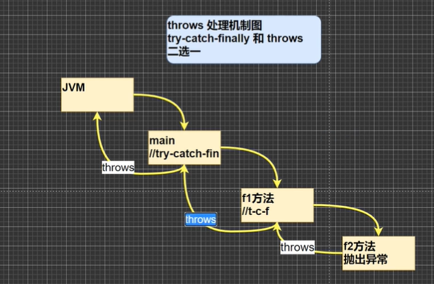

如果没有写 try-catch ，默认就是 throws

1)如果一个方法（中的语句执行时）可能生成某种异常，但是并不能确定如何处理这种异常，则此方法应显示地声明抛出异常，表明该方法将不对这些异常进行处理，而由该方法的调用者负责处理。
2)在方法声明中用throwsi语句可以声明抛出==异常的列表==，throws后面的异常类型可以是方法中产生的异常类型，也可以是它的父类。

### 自定义异常

1)定义类：自定义异常类名（程序员自己写）继承Exception或RuntimeException
2)如果继承Exception,属于编译异常
3)如果继承RuntimeException,.属于运行异常（==一般来说，继承RuntimeException==，因为可以使用默认的处理机制）

```java
public class CustomException {
    public static void main(String[] args) {
        int age = 800;
        if(!(age >= 18 && age <= 120)){
            // 可以通过构造器自定义信息
            throw new AgeException("你的年龄应该在18~120之间");
        }else{
            System.out.println("年龄正确");
        }
    }
}

class AgeException extends RuntimeException{
    public AgeException(String message){
        super(message);
    }
}
```

|        | 意义                     | 位置       | 后面跟的东西 |
| ------ | ------------------------ | ---------- | ------------ |
| throws | 处理异常的一种方式       | 方法声明处 | 异常类型     |
| throw  | 手动生成异常对象的关键字 | 方法体中   | 异常对象     |

练习

下面的代码输出什么

```java
public class ThrowException {
    public static void main(String[] args) {
        try{
            ReturnExceptionDemo.methodA();
        }catch (Exception e){
            System.out.println(e.getMessage());
        }
        ReturnExceptionDemo.methodB();
    }
}

class ReturnExceptionDemo{
    static void methodA(){
        try {
            System.out.println("进入方法A");
            throw new RuntimeException("制造异常");
        } finally {
            System.out.println("用A方法的finally");   //  <== 这里一定会执行，总之先把这句执行完
        }
    }
    static void methodB(){
        try{
            System.out.println("进入方法B");
            return;
        }finally {
            System.out.println("调用方法B的finally");
        }
    }
}

```

答案:

进入方法A
用A方法的finally
制造异常
进入方法B
调用方法B的finally

## 常用类

### 包装类

1)jdk5前的手动装箱和拆箱方式，装箱：基本类型->包装类型，反之，拆箱

```java
// 手动装箱
int n1 = 100; // 基本数据类型
Integer integer1 = new Integer(n1);
Integer integer2 = Integer.valueOf(n1); // 或者

// 手动拆箱
int i = integer1.intValue();
```

2)jdk5以后（含jdk5)的自动装箱和拆箱方式

```java
// 自动装箱
int n2 = 200;
Integer integer = n2;  // 底层还是 Integer.valueOf() 方法

// 自动拆箱
int n3 = integer;   // 底层还是 intValue() 方法
```

3)自动装箱底层调用的是valueOf方法，比如Integer.valueof()

经典面试题

```java
Object obj1 = true ? new Integer(1) : new Double(2.0);
System.out.println(obj1); //  输出 1.0

Object obj2;
if(true){
    obj2 = new Integer(1);
}else{
    obj2 = new Double(2.0);
}
System.out.println(obj2);  // 输出 1
```

==三元表达式当成一个整体==，所以会提升精度

### 包装类和String类型的转化

包装类(Integer)===> String

```java
Integer i = 100;
// 方式一
String s1 = i + "";
// 方拾贰
String s2 = i.toString();
// 方式三
String s3 = String.valueOf(i);
```

String ==> 包装类(Integer)

```java
String s = "12345";
Integer i1 = Integer.parseInt(s);  // 使用了自动装箱，先转化成int，再转换成Integer
Integer i2 = new Integer(s);      // 构造器方法
```

面试题

```java
Integer i = new Integer(1);
Integer j = new Integer(2);
System.out.println(i==j);  // False

Integer m = 1;    // Integer.valueOf()
Integer n = 1;
System.out.println(m==n);  // True

Integer x = 128;
Integer y = 128;
System.out.println(x==y);    // False
```

查看源码

```java
@HotSpotIntrinsicCandidate
public static Integer valueOf(int i) {
    if (i >= IntegerCache.low && i <= IntegerCache.high)
        return IntegerCache.cache[i + (-IntegerCache.low)];
    return new Integer(i);
}
```

IntegerCache的范围是 -128 ~ 127，在范围内直接返回，在范围外  new 一个

以下代码的结果

```java
Integer i1 = 127;
int i2 = 127;
Syetem.out.println(n1 == n2); // True

Integer n3 = 128;
int i4 = 128;
System.out.println(n3 == n4); // True
```

只要有==基本数据类型==，比较的就是==值是否相等==。

### String类

1) String对象用于保存字符串，也就是一组字符序列

2) 字符串常量对象是用双引号括起的字符序列。例如："你好”"、"12.97"、"boy"等

3) 字符串的字符使用Unicode字符编码，一个字符（不区分字母还是汉字）占两个字节。

4) String类较常用构造器（其它看手册）：

```java
String s1 new String();
String s2 new String(String original);
String s3 new String(char[] a);
String s4 new String(char[] a,int startlndex, int count)
```

5. String 类实现了 Serializable (可以在网络传输)、Comparable(对象可以比较大小)接口

6. String类是 final
7. String 对象有属性 private final byte[] value; 用于保存字符串内容
8. value 是 final 类型 ，(地址)不能修改

#### 常用方法

1. equals/区分大小写，判断内容是否相等
2. equalslgnoreCase/忽略大小写的判断内容是否相等
3. length/获取字符的个数，字符串的长度
4. indexOf/获取字符在字符串中第1次出现的索引，索引从0开始，如果找不到，返回-1
5. lastIndexOf/获取字符在字符串中最后1次出现的索引，索引从0开始，如找不到，返回-1
6. substring/截取指定范围的子串
7. trim/去前后空格
8. charAt:获取某索引处的字符，注意不能使用Str[index]这种方式.
9. toUpperCase
10. toLowerCase
11. concat
12. replace替换字符串中的字符
13. split分割字符串，对于某些分割字符，我们需要转义比如| \\\等 
14. compareTo/比较两个字符串的大小
15. toCharArray/转换成字符数组
16. format//格式字符串，%s字符串%c字符%d整型%.2f浮点型

### StringBuffer类

java.lang.String.Buffer代表可变的字符序列，可以对字符串内容进行增删。
很多方法与String相同，但StringBuffer是==可变长度的==。
StringBuffer是一个容器。

解读

```java
StringBuffer的直接父类是 AbstractStringBuilder 类
实现了 Serializable 接口，可以网络传输
在 AbstractStringBuilder 中有 char[] value 属性，不是final
这意味着 value 存放在堆中
    
String VS StringBuffer
1)String保存的是字符串常量，里面的值不能更改，每次String类的更新实际上就是更改地址，效率较低 private final char value[];
2)StringBuffer保存的是字符串变量，里面的值可以更改，每次StringBuffer的更新实际上可以更新内容，不用每次更新地址，效率较高 char[]value;这个放在堆.
```

构造器

```java
// 构造器一
// 创建一个大小为 16 的 char[], 用于存放字符内容
StringBuffer stringbuffer1 = new StringBuffer();

// 构造器二
// 通过构造器指定 char[] 的大小
StringBuffer stringbudder2 = new StringBuffer(100);

// 构造器三
// 通过传入 String 创建 StringBuffer,char[] 大小 为 string 大小 + 16
StringBuffer stringbuffer3 = new StringBuffer("Hello World");
```

String <===>  StringBuffer

```java
// String ===> StringBuffer
// 方式一,通过构造器
String str = "Hello World";
StringBuffer stringbuffer1 = new StringBuffer(str);

// 方拾贰，通过 append 方法
StringBuffer stringbuffer2 = stringbuffer1.append(str);


//StringBuffer ==> String
// 方式一，使用 StringBuffer 类提供的 toString 方法
StringBuffer stringbuffer3 = new StringBuffer("Hello Yae");
String string = stringbuffer3.toString();

// 方拾贰，使用String的构造器
String string2 =  new String(stringbuffer3);
```

常用方法

1) 增append
2) 删delete(start,end)
3) 改replace(start,,end,string)/将start---end间的内容替换掉，不含end
4) 查indexOf/查找子串在字符串第1次出现的索引如果找不到返回-1
5) 插insert
6) 获取长度length

### StringBuilder类

1)一个可变的字符序列。此类提供一个与StringBuffer兼容的APl,但不保证同步。该类被设计用作StringBuffer的一个简易替换，用在字符串缓冲区被单个线程使用的时候。如果可能，建议优先采用该类，因为在大多数实现中，它比StringBuffer要快
2)在StringBuilder上的主要操作是append和insert方法，可重载这些方法，以接受任意类型的数据。

解读

```java
StringBuilder 继承了 AbstractStringBuilder 类
实现了 Serializable,说明可以串行化
是final类，不能被继承
字符串序列存储在 父类，也在堆中
没有做互斥的处理，推荐在单线程的情况下使用StringBuilder
```

String、StringBuffer、StringBuilder的比较
1)	StringBuilder和StringBuffer非常类似，均代表可变的字符序列，而且方法
也一样
2)	String:不可变字符序列，效率低，但是复用率高。
3)	StringBuffer:可变字符序列、效率较高（增删）、线程安全，看源码
4)	StringBuilder:可变字符序列、效率最高、线程不安全
5)	String使用注意说明：
  string s="a":/创建了一个字符串
  s+="b”:/实际上原来的"a"字符串对像已经丢弃了，现在又产生了一个字符串s+"b”(也就是"ab")。如果多次执行这些改变串内容的操作，会导致大量副本字符串对象存留在内存中，降低效率。如果这样的操作放到循环中，会极大影响程序的性能=>==结论：如果我们对String做大量修改，不要使用String==

使用原则

> 1.如果字符串存在大量的修改操作，一般使用StringBuffer或StringBuilder
> 2.如果字符串存在==大量的==修改操作，并在==单线程==的情况，使用StringBuilder
> 3.如果字符串存在==大量的==修改操作，并在==多线程==的情况，使用StringBuffer
> 4.如果我们字符串==很少修改==，被==多个对象引用==，使用String,比如配置信息等

### Math类

1)abs绝对值
2)pow求幂
3)ceil向上取整
4)f1loor向下取整
5)round四舍五入
6)sqrt求开方
7)random求随机数/思考：
请写出获取a-b之间的一个随机整数，a,b均为整数？2-7
8)max求两个数的最大值
9)min求两个数的最小值

获取 int a 到 int b 之间的随机数

```java
public static int getRandomFromAtoB(int a, int b) {
        return (int) (a + Math.random() * (b - a + 1));
    }
```

### Arrays类

toString 返回数组的字符转形式

```java
Integer arr[] = {1,2,3,4};
Arrays.toString(arr);   // [1,2,3,4]
```

sort 排序(自然排序和定制排序)

```java
Integer arr[] = {5,3,4,1,2};
Arrays.sort(arr);  //  [1,2,3,4,5]

// 定制排序
Arrays.sort(arr, new Comparator<Integer>() {
            @Override
            public int compare(Integer o1, Integer o2) {
                return o2 - o1;
            }
        });   //  [5,4,3,2,1]
```

binarySearch 通过二分搜索法查找，要求必须排好序

copyOf 拷贝数组

```java
Integer arr[] = {1,2,3,4,5};
//从arr中 拷贝 arr.length 个元素到 newArr
Integer[] newArr = Arrays.copyOf(arr,arr.length);  // [1,2,3,4,5]

// 少一个
Integer[] newArr1 = Arrays.copyOf(arr,arr.length - 1); //[1,2,3,4]

// 多一个,用null填充
Integer[] newArr2 = Arrays.copyOf(arr,arr.length + 1); // [1,2,3,4,5,null]
```

fill 填充

```java
Integer[] arr = {1,2,3};
// 使用 100 填充数组
Array.fill(arr,100);  // [100,100,100]
```

equals 判断两个数组的元素是否完全一致

```java
Integer[] arr1 = {1,2,3,4};
Integer[] arr2 = new Integer[]{1,2,3,4};
System.out.println(Arrays.equals(arr1,arr2));  // true
```

asList 将一组值，转换成List

### System类

常用方法

1) exit 退出当前程序

   ```java
   System.exit(0);  // 表示退出程序
                    // 0 表示状态
   ```

2) arraycopy 复制数组元素

3) currentTimeMillis 返回 距离 1970-1-1 的毫秒数

4) gc 垃圾回收

### 大数的处理

BigInteger 类

创建

```java
BigInteger bigInteger = new BigInteger("999999999999999999990");
BigInteger bigInteger1 = new BigInteger("10");
```

运算

```java
// 加
BigInteger add = bigInteger.add(bigInteger1);
System.out.println(add);

// 减
BigInteger subtract = bigInteger.subtract(bigInteger1);

// 乘
BigInteger multiply = bigInteger.multiply(bigInteger1);

// 除
BigInteger divide = bigInteger.divide(bigInteger1);
```

BigDecimal 类

保存精度很高的数，double不够用

创建

```java
BigDecimal bigDecimal = new BigDecimal("3.141592652312111212121212121");

// 加减乘 和 BigInteger 相同
// 注意 divide
BigDecimal divide = bigDecimal.divide("3.14"); // 可能抛出异常 java.lang.ArithmeticException
//因为会变成无限小数
// 解决,BigDecimal.ROUND_CEILING 保留 分子的精度
BigDecimal divide = bigInteger.divide("3.14",BigDecimal.ROUND_CEILING);
```

### 日期类

####  第一代日期类

创建

```java
// 方式一 返回当前时间
Date date = new Date();
System.out.println("当前时间=" + date); 
// 当前时间=Sun Apr 17 21:41:02 CST 2022
// 按照西方输出

// 方式二 根据毫秒数创建
// public Date(long date)
Date time = new Date(9999999);
```

格式化

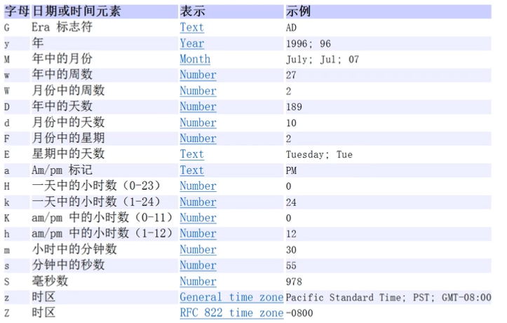

```java
SimpleDateFormat sdf = new SimpleDateFormat("yyyy年MM月dd日 hh:mm:ss E");
System.out.println(sdf.format(date));
//2022年04月17日 09:45:15 周日

// 创建方式三 把格式化的 String 转成 Date
// 使用的格式必须一样
String s = "2020年04月17日 09:45:15 周日";
Date parse = sdf.parse(s);  // 记得抛出一个 ParseException 异常
```

#### 第二代日期类

主要就是Calender 类

```java
public abstract class Calendar implements Serializable, Cloneable, Comparable<Calendar>
```

Calendar类是一个抽象类，它为特定瞬间与一组诸如YEAR、MONTH、DAY_OF_MONTH、HOUR等日历字段之间的转换提供了-些方法，并为操作日历字段（例如获得下星期的日期）提供了一些方法。

```java
// 创建 通过 getInstance 方法
Calendar calendar = Calendar.getInstance();

// 获取年
calendar.get(Calendar.YEAR);
```

#### 第三代日期类

前面两代日期类的不足分析
JDK1.0中包含了一个java.util.Date类，但是它的大多数方法已经在DK1.1引入Calendar类之后被弃用了。而Calendart也存在问题是：

1) 可变性：像日期和时间这样的类应该是不可变的。
2) 偏移性：Date中的年份是从1900开始的，而月份都从0开始。
3) 格式化：格式化只对Date有用，Calendar!则不行。
4) 此外，它们也不是线程安全的；不能处理闰秒等（每隔2天，多出1s)

常见方法

1)LocalDate(日期/年月日)、LocalTime(时l间/时分秒、LocalDateTime(日期时
间/年月日JDK8加入
LocalDate只包含日期，可以获取日期字段
LocalTime只包含时间，可以获取时间字段
LocalDateTime包含日期+时间，可以获取日期和时间字段

使用

```java
// 使用 now() 返回当前日期时间对象
LocalDateTime now = LocalDateTime.now();
//2022-04-17T22:14:00.486435900

System.out.println(now.getYear());     //   2022   年
System.out.println(now.getMonth());    // APRIL    月份的英语
System.out.println(now.getMonthValue());  // 4     月份的数字
System.out.println(now.getDayOfMonth());  // 17    日期
System.out.println(now.getDayOfWeek());  // SUNDAY   星期
System.out.println(now.getDayOfYear());  // 107     今年的第几天
System.out.println(now.getHour());         // 22     小时
System.out.println(now.getMinute());       // 17     分
System.out.println(now.getSecond());       // 34     秒
```

格式化

```java
DateTimeFormatter dateTimeFormatter = DateTimeFormatter.ofPattern("yyyy年MM月dd日 hh:mm:ss");
String str = dateTimeFormatter.format(now);
```

[【零基础 快速学Java】韩顺平 零基础30天学会Java_哔哩哔哩_bilibili](https://www.bilibili.com/video/BV1fh411y7R8?p=498&spm_id_from=pageDriver)

## 集合

一组集合的继承关系

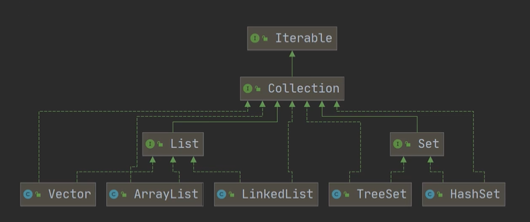

第二组集合

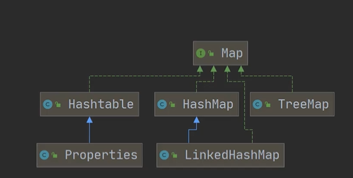

> 1.集合主要是两组(单例集合，双例集合)
>
> 2.Collection接口有两个重要的子接口 List，Set，实现的子类都是 ==单例集合==
>
> 3.Map 接口的实现子类 是==双例集合==，存放 K-V

Collection 接口和常用方法

> Collection 接口==实现类==的特点

```java
public interface Collection <E> extends Iterable <E>
```

1. Collection 实现紫萼李可以存放多个元素，每个元素可以是Object
2. 有些Collection的实现类，可以存放重复的元素，有些不可以
3. 有些Collection的实现类，有些是有序的(List),有些不是有序(Set)
4. Collection接口没有直接的实现子类，是通过它的子接口Set和List来实现的

> Iterator

1) Iterator对象称为迭代器，主要用于遍历Collection集合中的元素。

2) 所有实现了Collection接口的集合类都有一个iterator()方法，用以返回一个实现了Iterator接口的对象，即可以返回一个迭代器。

   ```java
   public class Iterator_ {
       public static void main(String[] args) {
           Collection books = new ArrayList<>();
   
           Book yae = new Book("Yae", 12.0);
           Book ei = new Book("Ei", 90.0);
           Book kokomi = new Book("kokomi", 120.99);
   
           books.add(yae);
           books.add(ei);
           books.add(kokomi);
   
           Iterator iterator = books.iterator();
   		
           // 快捷键 itit
           // 显示所有快捷键 ctrl + J
           while (iterator.hasNext()) {
               Object obj = iterator.next();
               System.out.println("the book is"+obj);
           }
       }
   }
   ```

   

3) Iterator的结构

4) Iterator仅用于遍历集合，Iterator本身并不存放对象。

5. 重置迭代器

   ```java
   iterator = books.iterator();
   ```

### List接口

> List 接口

List接口是Collection接口的子接口List

1) List集合类中元素有序（即添加顺序和取出顺序一致）、且==可重复==

2) List集合中的每个元素都有其对应的顺序索引，即==支持索引==。

3) List容器中的元素都对应一个整数型的序号记载其在容器中的位置，可以根据序号存取容器中的元素

常用方法

List集合里添加了一些根据索引来操作集合元素的方法

```java
void add(int index,Object ele):在index位置插入ele元素

boolean addAll(int index,Collection eles):从index位置开始将eles中的所有元素添加进来

Object get(int index):获取指定index位置的元素
    
int indexOf(Object obj):返回obj在集合中首次出现的位置

int lastIndexof(Object obj):返回obj在当前集合中末次出现的位置

Object remove(int index):移除指定index位置的元素，并返回此元素

Object set(int index,Object ele):设置指定index位置的元素为ele，相当于是替换.

List subList(int fromlndex,int tolndex):返▣从fromIndex到tolndex位置的子集合
    // 返回的集合 [fromIndex,toIndex)]
```

> List 接口的实现子类 Vector LinkedList 都可以用以下方法遍历

while迭代器

```java
Iterator iterator = dogs.iterator();

while (iterator.hasNext()) {
    Object obj = iterator.next();
    System.out.println(obj);
}
```

增强for

```java
for (Object dog : dogs) {
        //....
    }
```

普通for

```java
for(int i = 0; i < col.size(); i++){
    System.out.println(col.get(i));
}

```

#### ArrayList

> ArrayList 注意

1)permits all elements,including null,ArrayList可以加入null,并且多个
2)ArrayList是由数组来实现数据存储的
3)ArrayList基本等同于Vector,除了==ArrayList是线程不安全==（执行效率高）看源码.在多线程情况下，不建议使用ArrayList

[【零基础 快速学Java】韩顺平 零基础30天学会Java_哔哩哔哩_bilibili](https://www.bilibili.com/video/BV1fh411y7R8?p=510&spm_id_from=pageDriver)

> ArrayList 的底层操作机制

1) ArrayListi中维护了一个Object类型的数组elementData.[debug看源码]
   ```java
   transient Object[] elementData;
   // transient 表示该属性不会被序列化
   ```

2) 当创建ArrayList对像时，如果使用的是无参构造器，则初始elementData容量为0，第1次添加，则扩容elementData为10，如需要再次扩容，则扩容elementData为1.5倍。

3) 如果使用的是指定大小的构造器，则初始elementData容量为指定大小，如果需要扩容，则直接扩容elementData为1.5倍。

#### Vector

> Vector 底层结构和原码剖析

1) Vector类的定义说明
   ```java
   public class Vector<E>
   extends AbstractList<E>
   implements List<E>,RandomAccess,Cloneable,Serializable
   ```

2) Vectorl底层也是一个对象数组

   ```java
   protected Object[] elementData;
   ```

3) Vector是==线程同步的==，即线程安全，Vector类的操作方法带有==synchronized==
   ```java
   public synchronized E get(int index){
       if (index > elementCount)
       	throw new ArraylndexOutOfBoundsException(index);
       return elementData(index);
   }
   ```

4) 在开发中，==需要线程同步安全时，考虑使用Vector==

> Vector 和 ArrayList 的比较

|           | 底层结构             | 版本   | 线程安全(同步) 效率 | 扩容倍数                                                     |
| --------- | -------------------- | ------ | ------------------- | ------------------------------------------------------------ |
| ArrayList | 可变数组             | jdk1.2 | 不安全，效率高      | 如果有参构造,1.5倍<br/>如果是无参<br/>1.第一次10<br/>2.从第二次开始按1.5扩 |
| Vector    | 可变数组<br>Object[] | jdk1.0 | 安全，效率不高      | 如果是无参，默认10<br/>满后，就按2倍扩容<br/>如果指定大小，则每次直<br/>接按2倍扩 |

#### LinkedList

> LinkedList 全面说明

1) LinkedList底层实现了双向链表和双端队列特点

2) 可以添加任意元素（元素可以重复），包括nu川

3) 线程不安全，没有实现同步

> LinkedList 底层机制

1) LinkedList)底层维护了一个==双向链表==

2) LinkedList中维护了两个属性first和last分别指向==首节点==和==尾节点==

3) 每个节点(Node对象)，里面又维护了prev、next、item三个属性，其中通过prev指向前一个，通过next指向后一个节点。最终实现双向链表

4) 所以LinkedList的元素的添加和删除，不是通过数组完成的，相对来说效率较高。

> ArrayList 和 LinkedList 的比较

|            | 底层结构 | 增删的效率           | 改查的效率 |
| ---------- | -------- | -------------------- | ---------- |
| ArrayList  | 可变数组 | 较低<br>数组扩容     | 较高       |
| LinkedList | 双向链表 | 较高<br>通过链表追加 | 较低       |

如何选择ArrayList和LinkedList:

1) 如果我们==改查的操作多==，选择ArrayList

2) 如果我们==增删的操作多==，选择LinkedList

3) 一般来说，在程序中，80%-90%都是查询，因此大部分情况下会选择ArrayList

4) 在一个项目中，根据业务灵活选择，也可能这样，一个模块使用的是ArrayList,另外一个摸块是LinkedList,也就是说，要根据业务来进行选择

### Set接口

1) 无序（添加和取出的顺序不一致），没有索引

2) ==不允许重复元素==，所以最多包含一个null

3) JDK API中Set接口的实现类有：

   ```java
   TreeSet, HashSet
   ```

>  和List接口一样，Set接口也是Collection的子接▣，因此，常用方法和Collection接口一样.

> Set 接口的子类 HashSet 和 TreeSet 都可以用以下方法遍历

方式一 迭代器

```java
Set set = new HashSet<>();

// 获取迭代器
Iterator iterator = set.iterator();
while (iterator.hasNext()) {
    Object next = iterator.next();
    System.out.println(next);
}
```

方式二 增强 for

```java
for (Object o : set) {
    System.out.println(o);
}
```

==不能通过 索引 遍历==

#### HashSet

1) HashSet实现了Set接▣

   ```java
   public class HashSet<E>
       extends AbstractSet<E>
       implements Set<E>, Cloneable, java.io.Serializable
   ```

2) HashSet实际上是HashMap,看下源码
   ```java
   public HashSet() {
           map = new HashMap<>();
       }
   ```

3) 可以存放null值，但是只能有一个null

   ```java
   Set set = new HashSet<>();
   set.add(null);
   set.add(null);
   System.out.println(set);   // [null]
   ```

4) HashSet不保证元素是有序的，取决于hash后，再确定索引的结果

   ==不保证存放元素的顺序和取出的顺序一致==

5) 不能有重复元素/对像，在前面Set接口使用已经讲过

底层

==重要==

[【零基础 快速学Java】韩顺平 零基础30天学会Java_哔哩哔哩_bilibili](https://www.bilibili.com/video/BV1fh411y7R8?p=521&spm_id_from=pageDriver)

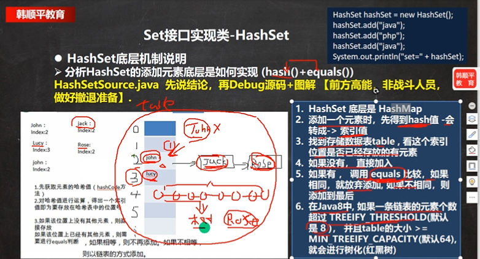

#### LinkedHashSet

1) LinkedHashSet是HashSet的子类

2) LinkedHashSet底层是一个LinkedHashMap,底层维护了一个数组+双向链表

3) LinkedHashSet根据元素的hashCode值来决定元素的存储位置，同时使用链表维护元素的==次序==，这使得元素看起来是以插入顺序保存的。

4) LinkedHashSet==不允浒添重复元素==

底层

[【零基础 快速学Java】韩顺平 零基础30天学会Java_哔哩哔哩_bilibili](https://www.bilibili.com/video/BV1fh411y7R8?p=528&spm_id_from=pageDriver)

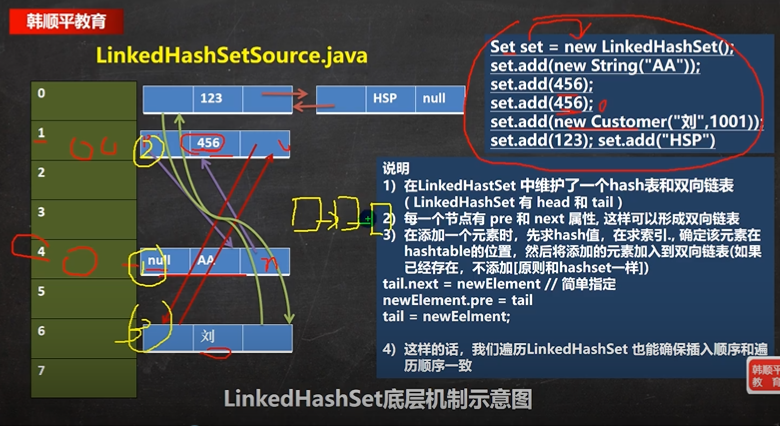

### Map接口

> 注意：这里讲的是JDK8的Map接口特点

1) Map与Collection==并列存在==。用于保存具有==映射关系==的数据：Key-Value

   Set 接口的 value 为默认的对象 PRESENT ；

2) Map中的key和value可以是==任何引用类型==的数据，会封装到HashMap$Node对象中

3) Map中的==key不允许重复==，原因和HashSet一样，前面分析过源码

4. Map中的==value可以重复==

5) Map的key可以为null,value也可以为null,==注意key为null,只能有一个，value为null,可以多个==.

6) 常用==String类==作为Map的key

7) key和value之间存在单向一对一关系，即通过指定的key总能找到对应的value

8) Map存放数据的key-value示意图，一对k-v是放在一个Node中的，有因为Node实现了Entry接口，有些书上也说一对k-v就是一个Entry(如图)

   [【零基础 快速学Java】韩顺平 零基础30天学会Java_哔哩哔哩_bilibili](https://www.bilibili.com/video/BV1fh411y7R8?p=532&spm_id_from=pageDriver)

   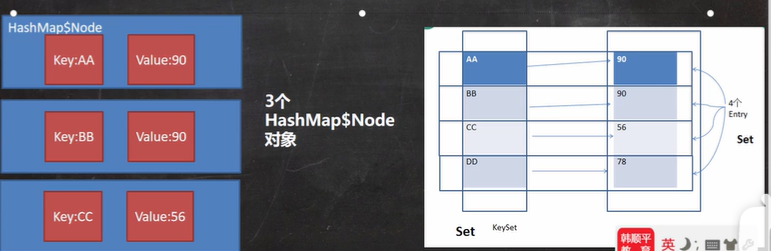

   把每一个Node 封装成一个 entry ， 然后丢到一个 entrySet 中 管理

   ==只是一个指向，没有创建新的对象==

   ```java
   HashMap<Object, Object> map = new HashMap<>();
   
   // 获取 entrySet
   Set set = map.entrySet();
   // enttrySet方法
   set.getKey();
   set.getValue();
   
   // 获取 key 的集合 Set
   Set set1 = map.keySet();
   
   // 获取 values 的 Collection
   Collection values = map.values();
   ```

> Map 接口的常用方法

1) put:添加

   ```java
   Map map = new HashMap();
   map.put("Yae","Miko");
   map.put("Ei","Shougun");
   ```

2) remove根据键删除映射关系

   ```java
   map.remove("Yae");
   ```

3) get:根据键获取值

   ```java
   map.get("Ei");  //  Shougun
   ```

4) size获取元素个数

   ```java
   map.size();  // 1
   ```

5) isEmpty:判断个数是是否为0

   ```java
   map.isEmpty();  // false
   ```

6) clear:清除

   ```java
   map.clear();
   ```

7) containsKey:查找键是否存在

   ```java
   map.containsKey("Ganyu");   //  flase
   ```

> Map 接口的遍历 六种方式

前提

1) ontainsKey:查找键是否存在

2) keySet:获取所有的键  Set

3) entrySet:获取所有关系k-v

4) values:获取所有的值  Collection

```java
HashMap map = new HashMap();

map.put("Yae","Miko");
map.put("Ei","Shougun");
map.put("Klee","Running sun");
map.put("Jean","Captain");
```

第一组  获 取 keySet

```java
Set set = map.keySet();

// 增强 for 循环，取出 key
for (Object o : set) {
    System.out.println(o);
}

// 迭代器
Iterator iterator = set.iterator();

while (iterator.hasNext()) {
    Object next =  iterator.next();
}
```

第二组   获取 values

```java
Collection values = map.values();

// 增强 for
for(Object value : values){
    System.out.println(value);
}


// 迭代器
Iterator iterator = values.iterator();
while (iterator.hasNext()) {
    Object next =  iterator.next();
    System.out.println(next);
}
```

第三组 通过 entrySet 获取 k-v

```java
Set set = map.entrySet();

// 增强 for
for (Object o : set) {
    Map.Entry entry = (Map.Entry) o;
    System.out.println(entry.getKey()+"-"+entry.getValue());
}

// 迭代器
Iterator iterator = set.iterator();
while (iterator.hasNext()) {
    Object next = iterator.next();
    Map.Entry entry = (Map.Entry) next;
    System.out.println(entry.getKey()+"-"+entry.getValue());
}
```

[【零基础 快速学Java】韩顺平 零基础30天学会Java_哔哩哔哩_bilibili](https://www.bilibili.com/video/BV1fh411y7R8?p=535&spm_id_from=pageDriver)

#### HashMap

1) Map接口的常用实现类：HashMap、Hashtable和Properties。

2) HashMap:是Map接口使用频率最高的实现类。

3) HashMap是以key-val对的方式来存储数据

4) key不能重复，但是值可以重复，允许使用null键和null值。

5) 如果添加相同的key,则会==覆盖==原来的key-val,等同于修改.(key不会替换，val会替换)

6) 与HashSet-一样，==不保证映射的顺序==，因为底层是以hash表的方式来存储的.

7) HashMap没有实现同步，因此是==线程不安全==的

> 底层机制

1) HashMap底层维护了Node类型的数组table,默认为null

2) 当创建对象时，将加载因子(loadfactor)初始化为0.75.

3) 当添加key-val时，通过key的哈希值得到在table的索引。

   然后判断该索引处是否有元素，
   如果没有元素直接添加。如果该索引处有元素，继续判断该元素的key是否和准备加入的
   key相等，

   如果相等，则直接替换val;如果不相等需要判断是树结构还是链表结构，做出相应处理。如果添加时发现容量不够，则需要扩容。

4) 第1次添加，则需要扩容table容量为16，临界值(threshold为12.

5) 以后再扩容，则需要扩容table容量为原来的2倍，临界值为原来的2倍，即24，依次类推

6) 在Java8中，如果一条链表的元素个数超过TREEIFY THRESHOLD(默认是8)，并且
   tablel的大小>=MIN TREEIFY CAPACITY(默认64)，就会进行树化（红黑树）

#### HashTable

1) 存放的元素是键值对：即K-V

2) hashtable的==键和值都不能为null==,否则会抛出NullPointerException

3) hashTable使用方法基本上和HashMap一样

4) hashTable是==线程安全的==(synchronized),hashMap是线程不安全的

5) 简单看下底层结构
   HashTable的应用案例
   /下面的代码是否正确，如果错误，为什么？HashTableExercise,java

   ```java
   Hashtable table new Hashtable();//ok
   table.put("john",100);//ok
   table.put(null,100);//异常
   table.put("john",null);//异常
   table.put("lucy",100);//ok
   table.put("lic",100);//ok
   table.put("ic",88);//替换
   System.out.println(table);
   ```

HashMap 和 HashTable

|           | 版本 | 线程安全<br/>(同步) | 效率 | 允许null键null值 |
| --------- | ---- | ------------------- | ---- | ---------------- |
| HashMap   | 1.2  | 不安全              | 高   | 可以             |
| Hashtable | 1.0  | 安全                | 较低 | 不可以           |

#### Properties

1. Properties类继承自Hashtables类并且实现了Map接口，也是使用一种键值对的形式来保存数据。

2. 他的使用特点和Hashtable类似

3. Properties还可以用于从Xx.properties文件中，加载数据到Properties类对像，并进行读取和修改

4. 说明：工作后xx.properties文件通常作为配置文件，这个知识点在IO流举例，有兴趣可先看文章

> 集合选型

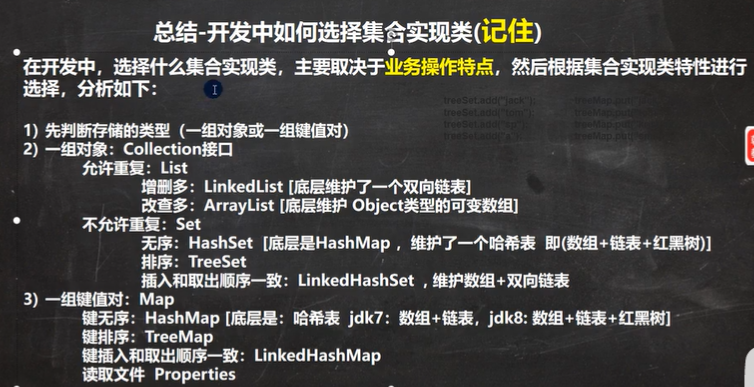

#### TreeSet

```java
TreeSet treeSet = new TreeSet(new Comparator() {
    @Override
    public int compare(Object o1, Object o2) {
        return ((String)o1).compareTo((String) o2);
    }
});  // 匿名内部类 定义排序方式

treeSet.add("Cyro");
treeSet.add("Andy");
treeSet.add("Boby");

for (Object o : treeSet) {
    System.out.println(o);
}

// Andy
// Boby
// Cyro
```

#### TreeMap

```java
TreeMap treeMap = new TreeMap(new Comparator() {
    @Override
    public int compare(Object o1, Object o2) {
        return ((String)o1).compareTo((String) o2);
    }
});

treeMap.put("Cyro",12);
treeMap.put("Andy",13);
treeMap.put("Boby",14);

for (Object o : treeMap.entrySet()) {
    Map.Entry entry = (Map.Entry) o;
    System.out.println(entry.getKey()+"-"+entry.getValue());
}

// Andy-13
// Boby-14
// Cyro-12
```

### Collectons 工具类

> 介绍

1) Collections是一个操作Set、List和Map等集合的工具类
2) Collections中提供了一系列静态的方法对集合元素进行排序查询和修改等操作

> 排序操作：(均为static方法)

1) reverse(List):反转List中元素的顺序

2) shuffle(List):对List集合元素进行随机排序

3) sort(List):根据元素的自然顺序对指定List集合元素按升序排序

4) sort(List,Comparator):根据指定的Comparator产生的顺序对List集合元素进行
   排序

5) swap(List,int i,int j):将指定list集合中的i处元素和j处元素进行交换

> 查找替换

1) Object max(Collection):根据元素的自然顺序，返回给定集合中的最大元素

2) Object max(Collection,Comparator):根据Comparator指定的顺序，
   返回给定集合中的最大元素

3) Object min(Collection)

4) Object min(Collection,Comparator)

5) int frequency(Collection,Object):返回指定集合中指定元素的出现次数

6) void copy(List dest,List src):将src中的内容复制到dest中

   完全的拷贝

   ```java
   ArrayList dest = new ArrayList();
   
   // 为了完全拷贝，需要先给 dest 赋值，大小 与 src.size() 一样
   for(int i = 0; i < src.size(); i++){
       dest.add("");  // 随意
   }
   
   Collections.copy(dest,src);
   ```

7. boolean replaceAll(List list,Object oldVal,Object newVal):新值替换List对像的所有旧值
   ```java
   Collections.replaceAll(list,"Tom","汤姆");
   ```

 练习

已知：Person类按照id和name重写了hashCode和equals方法，以下代码输出什么？

```java
public class HomeWork03 {
    public static void main(String[] args) {
        HashSet set = new HashSet();
        Person p1 = new Person("AA", 1001);
        Person p2 = new Person("BB", 1002);
        set.add(p1);
        set.add(p2);
        p1.name = "CC";
        set.remove(p1); // (1)
        System.out.println(set);
        //[Person{name='CC', id=1001}, Person{name='BB', id=1002}]
        set.add(new Person("CC",1001));  //  (2)
        System.out.println(set);
        //[Person{name='CC', id=1001}, Person{name='CC', id=1001}, Person{name='BB', id=1002}]
        set.add(new Person("AA",1001));  //(3)
        System.out.println(set);
        //[Person{name='CC', id=1001}, Person{name='CC', id=1001}, Person{name='AA', id=1001}, Person{name='BB', id=1002}]
    }
}
```

理解：(1) 此时 set 的table 表中有 两个值 p1，p2.

​					修改p1 的name属性后，hash 后的值也会发生变化，因此，在删除时，会因为找不到 p1 对应的位置而==删除失败==，返回CC,BB

​			(2) 此时新的对象 的 name 和 id 经过 hash 之后的值在 table 表中不存在，可以添加

​					为什么不存在？

​					因为 只存在 ("AA",1001) 和 ("BB",1002)，新的("CC",1001) 算出的是新的hash值

​					返回 CC,CC,BB

​			(3) 此时新的对象 的name 和id 经过hash之后的值与最开始 p1 是相同的，随后会进行equals比较，现在明显不同，于是 新对象 添加到到 p1 的后面

​					返回 CC,CC,AA,BB

## 泛型

泛型的好处

1) 编译时，检查添加元素的类型，提高了安全性

   ```java
   ArrayList<Dog> dogs = new ArrayList<>();
   Dog wang = new Dog("Wang");
   Cat meow = new Cat("Meow");
   dogs.add(wang);
   //dogs.add(meow); // 错的
   ```

   

2) 减少了类型转换的次数，提高效率

   ```java
   for(Dog dog : dogs){
       System.out.println(dog);
   }
   /*
   √不使用泛型
   Dog->Object->Dog/放入到ArrayList会先转成Object,在取出时，还需要转换成Dog
   √使用泛型
   Dog->Dog->Dog/放入时，和取出时，不需要类型转换，提高效率
   */
   ```

3) 不再提示编译警告

> 介绍

1)泛型又称参数化类型，是Jdk5.0出现的新特性，解决数据类型的安全性问题
2)在类声明或实例化时只要指定好需要的具体的类型即可。
3)Java泛型可以保证如果程序在编译时没有发出警告，运行时就不会产生ClassCastException.异常。同时，代码更加简洁、健壮
4)泛型的作用是：可以在类声明时通过一个标识表示类中某个属性的类型，或者是某个方
法的返回值的类型，或者是参数类型。

> 注意

1. interface List\<T>{),public class HashSet<E>)..
   说明：==T,E只能是引用类型==
   看看下面语句是否正确？：

   ```java
   List<Integer> list = new ArrayList<Integer>();//OK
   List<int> list2 = new ArrayList<int>();  // wrong
   ```

2. 在指定泛型具体类型后，可以传入==该类型或者其子类类型==

   ```java
   public class Generic03 {
       public static void main(String[] args) {
           Person<A> person = new Person<>(new A());
           Person<A> aPerson = new Person<>(new B());  // B 继承自 A
           Person<B> bPerson = new Person<>(new B());
       }
   }
   
   class A{}
   class B extends A{}
   
   class Person<E>{
       E e;
   
       public Person(E e) {
           this.e = e;
       }
   }
   ```

   

3. 泛型使用形式
   ```java
   List<Integer>list1 = new ArrayList<Integer>();
   List<Integer>list2 = new ArrayList<>();
   ```

3. 如果我们这样写List list = new ArrayList():默认给它的泛型是[\<E> E就是Object]

   ```java
   List list = new ArrayList();
   
   List list1 = new ArrayList<Object>();
   ```

> 自定义泛型类

基本语法
```java
class ClaaaName<T,R,M...>{
    //
}
```

注意细节
1)普通成员可以使用泛型（属性、方法）

```java
class Tiger<K,T,V>{
    K k;
    T t;
    V v;
    
    public Tiger(K k,T t,V v){
        //...
    }
}
```

2)使用泛型的数组，不能初始化

```java
class Tiger<T>{
    // 不允许，因为不知道类型，无法确定开辟多大空间
    T[] ts = new T[10];  
}
```

3)==静态方法中不能使用==类的泛型

```java
//因为静态是和类相关的，在类加载时，对象还没有创建
//所以，如果静态方法和静态属性使用了泛型，JVM就无法完成初始化
class Tiger<T>{
    public static void say(){}  // 错的
}
```

4)泛型类的类型，是在创建对象时确定的（因为创建对象时，需要指定确定类型)
5)如果在创建对像时，没有指定类型，默认为Object

> 自定义泛型类

基本语法
```java
interface 接口名<T,R..>{
    //...
}
```

注意细节

1) 接口中，==静态成员也不能使用泛型==（这个和泛型类规定一样）

2) 泛型接口的类型，在==继承接口==或者==实现接口==时确定

3) 没有指定类型，默认为Object

> 自定义泛型方法

基本语法
```java
public <T,R> void show(T t,R r){};
```

注意细节
1.泛型方法，可以定义在普通类中，也可以定义在泛型类中
2.当泛型方法被调用时，类型会确定
3.public void eat(E e){},修饰符后没有<T,R> eat方法不是泛型方法，而是使用了泛型

> 泛型的继承和通配符

1) 泛型不具备继承性
   ```java
   List<Object> list = new ArrayList<String>()://  错的
   ```

2) <?>：支持任意泛型类型

3) <? extends A>:支持A类以及A类的子类，规定了==泛型的上限==

4) <? super A>:支持A类以及A类的父类，不限于直接父类，规定了==泛型的下限==

## 进程与线程

> 进程

1. 进程是指运行中的程序，比如我们使用QQ,就启动了一个进程，操作系统就会为该进程分配内存空间。当我们使用迅雷，又启动了一个进程，操作系统将为迅雷分配新的内存空间。

2. 进程是程序的一次执行过程，或是正在运行的一个程序。是动态过程：有它自身的产生、存在和消亡的过程

> 线程

1. 线程由进程创建的，是进程的一个实体

2. 一个进程可以拥有多个线程

相关概念

1. 单线程：同一个时刻，只允许执行一个线程

2. 多线程：同一个时刻，可以执行多个线程，比如：一个q9进程，可以同时谢打开多个聊天窗口，一个迅雷进程，可以同时下载多个文件

3. 并发：同一个时刻，多个任务交替执行，造成一种“貌似同时”的错觉，简单的说，单核CPU实现的多任务就是并发。

4. 并行：同一个时刻，多个任务同时执行。多核cpu可以实现并行。

> 线程实现

在java中线程来使用有两种方法。

1. 继承Thread类，重写run方法

   ```java
   //1,当一个类继承了Thread类，该类就可以当做线程使用
   //2,我们会重写run方法，写上自己的业务代码
   //3.run Thread类实现了Runnable接口的run方法
   
   public class Thread01 {
       public static void main(String[] args) throws InterruptedException{
           Cat cat = new Cat();   // 可以当作线程使用
           cat.start();  // 启动线程
           cat.run();  // 如果直接执行 run 方法，就相当于由 main 调用的普通方法，只会按顺序执行
       }
   }
   
   class Cat extends Thread {
       @Override
       public void run() {
           int i = 0;
           while (true) {
               System.out.println("我是一只猫" + i++);
   
               try {
                   Thread.sleep(1000);
               } catch (InterruptedException e) {
                   e.printStackTrace();
               }
   
               if (i == 8) {
                   break;
               }
           }
       }
   }
   ```

2. 实现Runnable接口，重写run方法

   ```java
   public class Thread02 {
       public static void main(String[] args)throws InterruptedException {
           Dog dog = new Dog();
           Thread thread = new Thread(dog);
           thread.start();
       }
   }
   
   class Dog implements Runnable{
       int count = 0;
   
       @Override
       public void run() {
           while (true){
               System.out.println("小狗汪汪叫"+ ++count + "线程"+Thread.currentThread().getName());
   
               try{
                   Thread.sleep(1000);
               }catch (InterruptedException e){
                   e.printStackTrace();
               }
   
               if(count == 10){
                   break;
               }
           }
       }
   }
   ```

   

> 在多线程中，主线程结束之后，进程并==不一定==会结束
>
> 如果直接执行 run 方法，就相当于由 main 调用的普通方法，只会按顺序执行
>
> start()  调用 start0( ) 方法，由JVM 执行，之后线程并不一定会立马执行，只是将线程变为可以运行的状态，具体什么时候执行，取决于CPU(操作系统)

> 继承 thread vs 实现 Runnable 的区别

1.从java的设计来看，通过继承Thread或者实现Runnable接口来创建线程本质上没有区别，从dk帮助文档我们可以看到Thread类本身就实现了Runnable接口
2.实现Runnablef接口方式更==加适合多个线程共享一个资源的情况==，并且避免了单继承的限制

```java
T t = new T("Hello");
Thread thread01 = new Thread(t);
Thread thread02 = new Thread(t);
thread01.start();
thread02.start();

System.out.println("主线程结束");
```

两个线程共享了同一个资源 t

==建议使用实现接口的方式==

#### 常用方法

> 第一组

1. setName/设置线程名称，使之与参数name相同

2. getName/返回该线程的名称
3. start/使该线程开始执行；Java虚拟机底层调用该线程的start0方法

4. run/调用线程对像run方法：

5. setPriority/更改线程的优先级

6. getPriority/获取线程的优先级

7. sleep/在指定的毫秒数内让当前正在执行的线程休眠（暂停执行）

8. interrupt/中断线程

> 第二组

1. yield:线程的礼让。让出cpu,让其他线程执行，但礼让的时间不确定，所以也不一定礼让成功

2. join:线程的插队。插队的线程一旦插队成功，则肯定先执行完插入的线程所有的任务

   

案例：创建一个子线程，每隔1s输出hello,输出20次.主线程每隔1秒，输出hi,输出20次要求：两个线
程同时执行，当主线程输出5次后，就让子线程运行完毕，主线程再继续，

```java
public class Thread05 {
    public static void main(String[] args) throws InterruptedException {
        Thread thread = new Thread(new T());
        thread.start();
        for(int i = 0; i < 20; i++){
            System.out.println("主线程"+i);
            try {
                Thread.sleep(1000);
            } catch (InterruptedException e) {
                e.printStackTrace();
            }

            if(i == 5){
                System.out.println("让子线程先执行完毕");
                thread.join();   // 让对方插队
                System.out.println("子线程完毕，主线程开始");
            }
        }
    }
}

class T implements Runnable{
    private int i ;

    @Override
    public void run() {
        while (true){
            System.out.println("子线程"+ ++i);
            try {
                Thread.sleep(1000);
            } catch (InterruptedException e) {
                e.printStackTrace();
            }
            if(i == 20){
                break;
            }
        }
    }
}
```

> 用户线程和守护线程

1. 用户线程：也叫工作线程，当线程的任务执行完或通知方式结束

2. 守护线程：一般是为工作线程服务的，==当所有的用户线程结束，守护线程自动结束==

   ```java
   thread.setDaemon(true);
   ```

3. 常见的守护线程：垃圾回收机制

> Synchronized

1. 在多线程编程，一些敏感数据不允许被多个线程同时访问，此时就使用同步访问技术，保证数据在任何时刻，最多有一个线程访问，以保证数据的完整性。

2. 也可以这里理解：线程同步，即当有一个线程在对内存进行操作时，其他线程都不可以对这个内存地址进行操作，直到该线程完成操作，其他线程才能对该内存地址进行操作.

同步具体方法

1. 同步代码块
   ```java
   synchronized(对象){//得到对像的锁，才能操作同步代码
   //需要被同步代码:
   }
   ```

2. synchronizedi还可以放在方法声明中，表示整个方法-为同步方法
   ```java
   public synchronized void m (String name){
   //需要被同步的代码
   }
   ```

> 互斥锁

1. Java语言中，引入了对象互斥锁的概念，来保证共享数据操作的完整性。

2. 每个对象都对应于一个可称为“互斥锁”的标记，这个标记用来保证在任一时刻，只能有一个线程访问该对象。

3. 关键字synchronized来与对象的互斥锁联系。当某个对象用synchronized修饰时，表明该对象在任一时刻只能由一个线程访问

4. 同步的局限性：导致程序的执行效率要降低

5. 同步方法（非静态的）的锁可以是this,也可以是其他对像（要球是同一个对像）

6. 同步方法（静态的）的锁为当前类本身。

1.同步方法如果没有使用static修饰：默认锁对象为this
2.如果方法使用static修饰，默认锁对象：当前类.class
3.实现的落地步骤：
需要先分析上锁的代码
选择同步代码块或同步方法
要求多个线程的锁对象为同一个即可！

```java
synchronized (this){
    //...  代码块
}

Object object = new Object();
synchronized (object){}
```

> 释放锁

==释放锁==

1.当前线程的同步方法、同步代码块执行结束
案例：上厕所，完事出来
2.当前线程在同步代码块、同步方法中遇到break、return。
案例：没有正常的完事，经理叫他修改bug,不得已出来
3.当前线程在同步代码块、同步方法中出现了未处理的Error或Exception,导致异常结束
案例：没有正常的完事，发现忘带纸，不得已出来
4.当前线程在同步代码块、同步方法中执行了线程对象的wt0方法，当前线程暂停，并释
放锁。
案例：没有正常完事，觉得需要酝酿下，所以出来等会再进去

==不释放锁==

1.线程执行同步代码块或同步方法时，程序调用Thread.sleep()、Thread..yield0方
法暂停当前线程的执行，不会释放锁
案例：上厕所，太困了，在坑位上眯了一会
2.线程执行同步代码块时，其他线程调用了该线程的suspend()方法将该线程挂起，
该线程不会释放锁。
提示：应尽量避免使用suspend()和resume():来控制线程，方法不再推荐使用

## I/O流

### 常用的文件操作

#### 创建文件对象相关构造器方法   

> new File(String pathname);  根据路径构建一个File对像

```java
public void create01(){
        String filePath = "E:\\hello.txt";
        File file = new File(filePath);

        try{
            file.createNewFile();
            System.out.println("文件创建成功");
        }catch (IOException e){
            e.printStackTrace();
        }
    }
```

> new File(File parent,String child);//根据父目录文件+子路径构建

```java
public void create02(){
        File parentFile = new File("E:\\");
        String fileName = "world.txt";
        File file = new File(parentFile, fileName);

        try{
            file.createNewFile();
            System.out.println("创建文件成功");
        }catch (IOException e){
            e.printStackTrace();
        }
    }
```

> new File(String parent,String child);   根据父目录+子路径构建

```java
public void create03(){
        String parentPath = "E:\\";
        String childPath = "Java.txt";
        File file = new File(parentPath, childPath);

        try {
            file.createNewFile();
            System.out.println("文件创建成功");
        } catch (IOException e) {
            e.printStackTrace();
        }
    }
```

#### 获取文件的相关信息

```java
getName            获取文件名

getAbsolutePath    获取绝对路径

getParent          获取父级目录

length             文件大小（字节）

exists             是否存在

isFile             是否是文件

isDirectory        是否是目录
```

#### 目录操作

```java
file.exists 是否存在
    
file.delete   删除
    
file.mkdir    一级目录
file.mkdirs   多级目录
```

### IO流原理及流的分类

#### 原理

> 1.I/O是Input/Outputl的缩写，IO技术是非常实用的技术，用于处理数据传输。
> 如读/写文件，网络通讯等。
> 2.Java程序中，对于数据的输入/输出操作以”流(stream)”的方式进行。
> 3.java.io包下提供了各种“流”类和接口，用以获取不同种类的数据，并通过方
> 法输入或输出数据
>
> 4.输入input:读取外部数据(磁盘、光盘等存储设备的数据)到程序（内存）中。
> 5.输出output:将程序（内存）数据输出到磁盘、光盘等存储设备中

#### 流的分类

> √按操作数据单位不同分为：字节流(8 bit),字符流（按字符，对应几个字节)
> √按数据流的流向不同分为：输入流，输出流
> √按流的角色的不同分为：节点流，处理流/包装流

| (抽象基类) | 字节流       | 字符流 |
| ---------- | ------------ | ------ |
| 输入流     | InputStream  | Reader |
| 输出流     | OutputStream | Writer |

### 常用类

#### InputStream：字节输入流

> InputStream抽象类是所有类字节输入流的超类

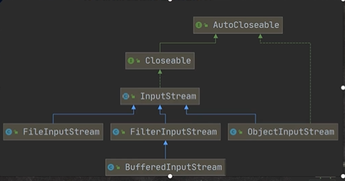

InputStream常用的子类

> 1.FilelnputStream:文件输入流

```java
public static void readFile01(){
        String filePath = "E:\\hello.txt";
        int read = 0;
        FileInputStream fileInputStream = null;
        try {
//            创建 FileInputStream 对象，用于读取文件
            fileInputStream = new FileInputStream(filePath);
//            从该输入流读取一个字节的数据，如果没有输入可用，此方法将阻止
//            如果返回 -1， 表示读取完毕
            while ((read = fileInputStream.read()) != -1){
                System.out.print((char)read);
            }
        } catch (IOException e) {
            e.printStackTrace();
        }finally {
//            关闭文件，释放资源
            try {
                fileInputStream.close();
            } catch (IOException e) {
                e.printStackTrace();
            }
        }
    }

public static void readFile02(){
        String filePath = "E:\\hello.txt";
        byte[] buf = new byte[8];
        FileInputStream fileInputStream = null;
        int len = 0;
        try {
//            创建 FileInputStream 对象，用于读取文件
            fileInputStream = new FileInputStream(filePath);
//            从该输入流读取一个字节的数据，如果没有输入可用，此方法将阻止
//            如果返回 -1， 表示读取完毕
            while ((len = fileInputStream.read(buf)) != -1){
                System.out.println(new String(buf,0,len));
            }
        } catch (IOException e) {
            e.printStackTrace();
        }finally {
//            关闭文件，释放资源
            try {
                fileInputStream.close();
            } catch (IOException e) {
                e.printStackTrace();
            }
        }
    }
```

2.BufferedInputStream:缓冲字节输入流
3.ObjectInputStream:对象字节输入流

#### OutputStream:字节输出流

> FileOutputStream 文件字节输出流

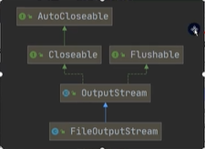


```java
//三种写入方法
public void write(int b); // 写入一个字符
public void write(byte[] b);  // 写入字符串
public void write(byte[] b,int off,int len);  // 写入字符串，off 偏移量，len


public static void writeFile(){
//        创建 FileOutputStream 对象
        String filePath = "E:\\a.txt";
        FileOutputStream fileOutputStream = null;

        try {
//            1.new FileOutputStream(filePath) 创建方式，当写入内容时，会覆盖
//            2.new FileOutputStream(filePath, true) 创建方式,当写入内容时，会追加到末尾
           fileOutputStream =  new FileOutputStream(filePath,true);
//           fileOutputStream.write('a');
            String str = "Hello World";
            fileOutputStream.write(str.getBytes());
        }  catch (IOException e) {
            e.printStackTrace();
        } finally {
            try {
                fileOutputStream.close();
            }catch (IOException e){
                e.printStackTrace();
            }
        }

    }
```

