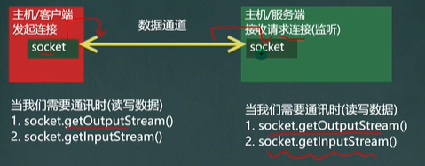
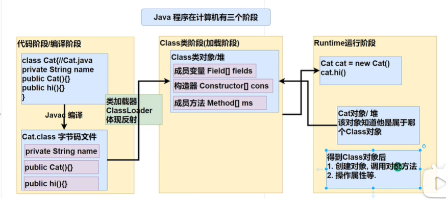

# java 第三阶段

## 网络编程

### 相关概念

#### ip地址

1. 概念：用于唯一标识网络中的每台计算机/生机

2. 查看ip地址：ipconfig

3. ip地址的表示形式：点分十进制x.xxx.xx.xx

4. 每一个十进制数的范围：0~255

5. ip地址的组成=网络地址+主机地址，比如：192.168.16.69

6. iPv6是互联网工程任务组设计的用于替代PV4的下一代P协议，其地址数量号称可以
   为全世界的每一粒沙子编上一个地址。

7. 由于1PV4最大的问题在于网络地址资源有限，严重制约了互联网的应用和发展。IPV6
   的使用，不仅能解决网络地址资源数量的问题，而且也解决了多种接入设备连入互联
   的障碍

[【零基础 快速学Java】韩顺平 零基础30天学会Java_哔哩哔哩_bilibili](https://www.bilibili.com/video/BV1fh411y7R8?p=663&spm_id_from=pageDriver)

### InetAddress 类

1. 获取本机InetAddress对像getLocalHost

2. 根据指定主机名/域名获取ip地址对象getByName

3. 获取InetAddress对像的主机名getHostName

4. 获取InetAddress对象的地t址getHostAddress

```java
public class UseInetAddress{
   public static void main(String[] args) throws UnknownHostException {
//        获取本机的 InetAddress 对象
      InetAddress localHost = InetAddress.getLocalHost();
      System.out.println(localHost);

//        根据指定主机名，获取 InetAddress 对象
      InetAddress byName = InetAddress.getByName("DESKTOP-I9EJ2FT");
      System.out.println("host1="+byName);

//        根据指定域名，获取 InetAddress 对象
      InetAddress byName1 = InetAddress.getByName("www.baidu.com");
      System.out.println("baidu="+byName1);

//      根据 InetAddress 对象，获取 ip 地址
      String hostAddress = byName1.getHostAddress();
      System.out.println("hostAddress="+hostAddress);

//        获取主机名
      String hostName = byName1.getHostName();
      System.out.println("hostName="+hostName);
   }
}
```

### Socket 套接字

基本介绍

1. 套接字(Socket)开发网络应用程序被广泛采用，以至于成为事实上的标准。

2. 通信的两端都要有Socket,是两台机器间通信的端点

3. 网络通信其实就是Socket间的通信。

4. Socket:允许程序把网络连接当成一个流，数据在两个Socket间通过IO传输。

5. 一般主动发起通信的应用程序属客户端，等待通信请求的为服务端



> 字节流

服务端

```java
public class SocketTCPServer {
    public static void main(String[] args) throws IOException {
//        在本机的 9999 端口监听，等待连接
//        细节：要求 9999 端口没有被占用
        ServerSocket serverSocket = new ServerSocket(9999);
        System.out.println("监听 9999 端口，等待连接。。。");
//        没有连接 9999 端口时，会阻塞
//        如果有连接，会返回一个 Socket 对象
        Socket accept = serverSocket.accept();
        System.out.println("服务端 socket=" + accept.getClass());

        InputStream inputStream = accept.getInputStream();
        byte[] data = new byte[1024];
        int len;
        while ((len = inputStream.read(data)) != -1)
            System.out.println(new String(data,0,len));
        
        OutputStream outputStream = socket.getOutputStream();
        outputStream.write("Hello Client".getBytes());
        socket.shutdownOutput();  // 结束标记

        inputStream.close();
        outputStream.close();
        accept.close();
        serverSocket.close();
    }
}
```

客户端

```java
public class SocketTCPClient {
    public static void main(String[] args) throws IOException {
//        连接服务器(ip,端口)
        Socket socket = new Socket(InetAddress.getLocalHost(), 9999);
//        连接上后，生成 Socket
//        通过 socket.getOutputStream()
        OutputStream outputStream = socket.getOutputStream();

        outputStream.write("hello world".getBytes());
        socket.shutdownOutput(); // 结束标记

        InputStream inputStream = socket.getInputStream();
        byte[] buf = new byte[1024];
        int len;
        while ((len = inputStream.read(buf)) != -1)
            System.out.println(new String(buf,0,len));

        inputStream.close();
        outputStream.close(); // 关闭流
        socket.close();       // 关闭 socket
        System.out.println("客户端退出");
    }
}
```

> 字符流

服务端

```java
public class SocketTCPServer {
    public static void main(String[] args) throws IOException {
        ServerSocket serverSocket = new ServerSocket(9999);
        Socket socket = serverSocket.accept();

        BufferedReader bufferedReader = new BufferedReader(new InputStreamReader(socket.getInputStream()));
        String line = bufferedReader.readLine();
        System.out.println(line);

        BufferedWriter bufferedWriter = new BufferedWriter(new OutputStreamWriter(socket.getOutputStream()));
        bufferedWriter.write("Hello Client");
        bufferedWriter.newLine();  // 插入一个换行符
        bufferedWriter.flush();  // 使用字符流需要刷新，否则不会写入

        bufferedReader.close();
        bufferedWriter.close();
        socket.close();
        serverSocket.close();
    }
}
```

客户端

```java
public class SocketTCPClient {
    public static void main(String[] args) throws IOException {
        Socket socket = new Socket(InetAddress.getLocalHost(),9999);
//        转成 包装流
        BufferedWriter bufferedWriter = new BufferedWriter(new OutputStreamWriter(socket.getOutputStream()));
        bufferedWriter.write("Hello Server");

        bufferedWriter.newLine();  // 插入一个换行符
        bufferedWriter.flush();  // 使用字符流需要刷新，否则不会写入

        BufferedReader bufferedReader = new BufferedReader(new InputStreamReader(socket.getInputStream()));
        String line = bufferedReader.readLine();
        System.out.println(line);

        bufferedWriter.close();
        bufferedReader.close();
        socket.close();
    }
}
```

告诉另一边“我说完了”  => writer.newLine( )

另一边  => reader.readLine( )

==一定要 flush==

> netstat 指令

1.netstat-an 可以查看当前主机网络情况，包括端▣监听情况和网络连接情况
2.netstat-an | more可以分页显示
3.要求在dos控制台下执行r

> ●TCP网络通讯不为人知的秘密
> 当客户端连接到服务端后，实际上客户端也是通过==一个端口==和服务端进行通讯的，这
> 个端口是TC/IP来分配的，是不确定的，是随机的。

### UDP

1. 类DatagramSocket和DatagramPacket[数据包/数据报]实现了基于UDP协议网络程序。

2. UDP数据报通过数据报套接字DatagramSocket发送和接收，系统==不保证==UDP数据报一定能够安全送到目的地，也不能确定什么时候可以抵达。

3. DatagramPacket对象封装了UDP数据报，在数据报中包含了发送端的1P地址和端口号以及接收端的P地址和端口号。

4. UDP协议中每个数据报都给出了完整的地址信息，因此无须建立发送方和接收方的连接

>UDP说明：
>
>1. 没有明确的服务端和客户端，演变成数据的发送端和接收端
>
>2. 接收数据和发送数据是通过DatagramSocket对象完成
>
>3. 将数据封装到DatagramPacket对像/装包
>
>4. 当接收到DatagramPacket对象，需要进行拆包，取出数据
>
>5. DatagramSocket可以指定在哪个端口接收数据

UDP通信

```java
public class UDPReceiverA {
    public static void main(String[] args) throws IOException {
//        1.创建一个 DatagramSocket 对象, 在 9999 端口接收数据
        DatagramSocket socket = new DatagramSocket(9999);
//        2.构建一个 DatagramPacket 对象，准备接收数据
//        一个数据包最大 64k
        byte[] buf = new byte[1024];
        DatagramPacket packet = new DatagramPacket(buf, buf.length);

//        3.调用接收方法，将 网络传输的 DatagramPacket 对象填充到 packet 对象
//        如果没有数据发送到本机 9999 端口，会阻塞
        System.out.println("接收端A在等待...");
        socket.receive(packet);

//        4.拆包 packet
        int length = packet.getLength();  // 实际的数据长度
        byte[] data = packet.getData();
        String str = new String(data,0,length);
        System.out.println(str);
        
//       回送
        data = "好的 明天见~".getBytes();
        packet =  new DatagramPacket(data,data.length, InetAddress.getLocalHost(),9998);
        socket.send(packet);


        socket.close();
        System.out.println("A端退出");

    }
}
```

```java
public class UDPReceiverB {
    public static void main(String[] args) throws IOException {
//        1.创建一个 DatagramSocket 对象, 在 9998 端口发送数据
        DatagramSocket socket = new DatagramSocket(9998);

//        2.将数据封装 到 DatagramPacket 对象
        byte[] data = "Hello 明天吃火锅".getBytes();
//        byte buf[], int length,
//        InetAddress address, int port
        DatagramPacket packet = new DatagramPacket(data, data.length, InetAddress.getLocalHost(), 9999);
        socket.send(packet);

//        接收 A 的回复
        byte[] buf = new byte[1024];
        packet = new DatagramPacket(buf, buf.length);
        socket.receive(packet);

        int length = packet.getLength();
        data = packet.getData();

        String s = new String(data, 0, length);
        System.out.println("B端收到" + s);

        socket.close();
        System.out.println("B端退出");
    }
}
```

## 反射

https://www.bilibili.com/video/BV1fh411y7R8?p=712&spm_id_from=pageDriver

1.反射机制允许程序在执行期借助于ReflectionAPI取得任何类的内部信息（比如成员变量，构
造器，成员方法等等)，并能操作对象的属性及方法。反射在设计模式和框架底层都会用到
2.加载完类之后，在堆中就产生了一个Class类型的对像（==一个类只有一个Class对象==），这个对象包含了类的完整结构信息。通过这个对象得到类的结构。这个对象就像一面镜子，透过这个镜子看到类的结构，所以，形象的称之为：==反射==

原理图




## JDBC

### JDBC 程序编写步骤

1. 注册驱动-加载Driver类

   下载 <span style="background-color:yellow"><a href="https://dev.mysql.com/downloads/connector/j/">mysql-connector-java-8.0.29.jar</a></span>

   在项目中新建 libs 文件夹，将 .jar 文件移入

   <span style="background-color:yellow">add to project</span>

2. 获取连接-得到Connection

3. 执行增删改查-发送SQL给mysql执行

4. 释放资源-关闭相关连接

```java
package com.neta.jdbc;

import com.mysql.cj.jdbc.Driver;

import java.sql.Connection;
import java.sql.SQLException;
import java.sql.Statement;
import java.util.Properties;

public class Jdbc01 {
    public static void main(String[] args) throws SQLException {

        // 1.注册驱动
        Driver driver = new Driver();

        // 2.得到连接
        // (1) jdbc:mysql 协议
        // (2) localhost 主机 (也可以是 ip)
        // (3) 3306 端口
        // (4) exercise 数据库
        // (5) 本质是 socket
        String url = "jdbc:mysql://localhost:3306/exercise";

        // 将用户名和密码封装
        // user 和 password 是规定好的
        Properties properties = new Properties();
        properties.setProperty("user","root");
        properties.setProperty("password","password");

        Connection connect = driver.connect(url, properties);

        // 3.执行 mysql
        String sql = "INSERT INTO actor VALUES (NULL,'Yae','女','2000-10-22','138')";

        // 得到 statement 对象
        Statement statement = connect.createStatement();
        int rows = statement.executeUpdate(sql);
        // 如果是 dml 函数， rows 表示影响的行数

        System.out.println(rows > 0 ? "成功":"失败");
        connect.close();
    }
}

```

### 五种连接方式

1. 获取 Driver 实现类对象，<b>静态加载</b>

   ```java
   public class Connect01{
       public static void main(String[] args){
           Driver driver = new com.mysql.cj.jdbc.Driver();
   
           String url = "jdbc:mysql://localhost:3306/jdbc_db";
   
           Properties info = new Properties();
           info.setProperty("user","root");
           info.setProperty("password","password");
           Connection conn = driver.connect(url,info);
       }
   }
   ```

2. 反射，<b>动态加载</b>

   ```java
   public class Connect02{
       public static void main(String[] args){
           Class clazz = Class.forName("com.mysql.cj.jdbc.Driver");
           Driver driver = (Driver) clazz.newInstance();
   
           //...
       }
   }
   ```

3. DriverManager

   ```java
   public class Connect03{
       public static void main(String[] args){
           Class<?> cls = Class.forName("com.mysql.cj.jdbc.Driver");
           Driver driver = (Driver)cls.newInstance();
   
           String url = "jdbc:mysql://localhost:3306/exercise";
   
           String user = "root";
           String password = "password";
   
           DriverManager.deregisterDriver(driver);
   
           Connection connection = DriverManager.getConnection(url, user, password);
           System.out.println(connection);
       }
   }
   ```

4. 使用 Class.forName 自动完成注册驱动，简化代码，<b> 用得最多</b>

   ```java
   public class Connect03{
       public static void main(String[] args){
           Class.forName("com.mysql.cj.jdbc.Driver");  // 看这里
   
           String url = "jdbc:mysql://localhost:3306/exercise";
   
           String user = "root";
           String password = "password";
   
           Connection connection = DriverManager.getConnection(url, user, password);
           System.out.println(connection);
       }
   }
   ```

   Driver 原码

   ```java
   static {
           try {
               DriverManager.registerDriver(new Driver());
           } catch (SQLException var1) {
               throw new RuntimeException("Can't register driver!");
           }
       }
   
   // 含有静态代码块
   // 在类加载的时候就会执行 DriverManager.registerDriver(new Driver())
   ```

5. 使用配置文件，连接数据库更灵活

   ```properties
   user=root
   password=root
   url=jdbc:mysql://localhost:3306/example
   driver=com.mysql.cj.jdbc.Driver
   ```

   

### ResultSet

通过 next() 方法获取每一行数据，没有则返回 false


### Statement

1. Statement对象用于执行静态SQL语句并返回其生成的结果的对象

2. 在连接建立后，需要对数据库进行访问，执行命名或是SQL语句，可以通过

   Statement   <b style="background-color:yellow;color:red">(不用的)</b>                                   [存在SQL注入]
   PreparedStatement                       [预处理]
   CallableStatement                         [存储过程]

3. Statement)对象执行SQL语句，存在SQL注入风险(SQL Injection)

4. SQL注入是利用某些系统没有对用户输入的数据进行充分的检查，而在用户输入数据中注入非法的SQL语句段或命令，恶意攻击数据库。

5. 要防范SQL注入，只要用PreparedStatement(从Statement扩展而来)取代Statement就可以了

### PreparedStatement

1. PreparedStatement执行的SQL语句中的参数用问号(？)来表示，调用PreparedStatement对象的setXxx0方法来设置这些参数

   setXxx0方法有两个参数，第一个参数是要设置的SQL语句中的参数的索引（从1开始），第二个是设置的SQL语句中的参数的值

2. 调用executeQuery(),返回ResultSet对象

3. 调用executeUpdate():执行更新，包括增、删、修改

```java
// ...

Connection connection = DriverManager.getConnection(url, user, password);

String sql = "SELECT user, password FROM admin WHERE user=? and password=?";

PreparedStatement preparedStatement = connection.prepareStatement(sql);

preparedStatement.setString(1,"root"); // 设置占位符的值
preparedStatement.setString(2,"abc");

ResultSet resultSet = preparedStatement.executeQuery();

while (resultSet.next()){
    String uer = resultSet.getString(1);
    String pwd = resultSet.getString(2);
    System.out.printf("user=%s\npwd=%s",user,pwd);
}

resultSet.close();
preparedStatement.close();
connection.close();
```

```java
// dml
String sql1 = "insert into admin values(?,?)";

String sql2 = "update admin set ? = ?";

String sql3 = "delete from admin where user=?"
    
```

### JDBC API

<table>
    <tr>
    	<th></th>
        <th>接口/类</th>
        <th>方法</th>
    </tr>
    <tr>
    	<td rowspan="15">JDBC API</td>
        <td>DriverManager<br/>驱动管理类</td>
        <td>getConnection(url,user,pwd);获取连接</td>
    </tr>
    <tr>
    	<td rowspan="2">Connection接口</td>
        <td>createStatement();创建Statement对象</td>
    </tr>
    <tr>
    	<td>prepareStatement(sql);创建预处理对象</td>
    </tr>
    <tr>
    	<td rowspan="3">Statement接口</td>
        <td>executeUpdate(sql);执行 dml 语句，返回影响行数</td>
    </tr>
    <tr>
    	<td>executeQuery(sql);执行查询，返回 ResultSet 对象</td>
    </tr>
    <tr>
    	<td>execute(sql);执行任意sql语句，返回布尔值</td>
    </tr>
    <tr>
    	<td rowspan="5">PreparedStatement接口</td>
        <td>executeUpdate();执行 dml</td>
    </tr>
    <tr>
    	<td>executeQuery();执行查询</td>
    </tr>
    <tr>
    	<td>execute();执行任意 sql</td>
    </tr>
    <tr>
    	<td>setXxx(parameterIndex,x);</td>
    </tr>
    <tr>
    	<td>setObject(parameterIndex,x);</td>
    </tr>
    <tr>
    	<td rowspan="4">ResultSet</td>
        <td>next();光标向下移，如果没有，返回 false</td>
    </tr>
    <tr>
    	<td>previous();光标上移，如果没有，返回 false</td>
    </tr>
    <tr>
    	<td>getXxx(列的索引|列名); 返回对象列的值，类型为 Xxx</td>
    </tr>
    <tr>
    	<td>getObject(列的索引|列名); 返回对应列的值，类型为 Object</td>
    </tr>
</table>


### 事务

1. JDBC程序中当一个Connection对象创建时，默认情况下是自动提交事务：每次执行一个SQL语句时，如果执行成功，就会向数据库自动提交，而不能回滚

2. JDBC程序中为了让多个SQL语句作为一个整体执行，需要使用事务
3. 调用Connection的setAutoCommit(false)可以取消自动提交事务
4. 在所有的SQL语句都成功执行后，调用commit();方法提交事务
5. 在其中某个操作失败或出现异常时，调用rollback():方法回滚事务

案例 模拟转账

数据表

```sql
create table account(
	id int primary key auto_increment,
    name varchar(32) not null default '',
    balance double not null default 0
);

insert into account values (null,'Yae',3000);
insert into account values (null,'Ei',10000);
```

事务处理

```java
// get connection

String sql1 = "update account set balance = balance - 100 where id = 1";
String sql2 = "update account set balance = balance + 100 where id = 2";

PreparedStatement preparedStatement = null;

try {
    connection = JDBCUtils.getConnection();
//  设置为不自动提交
    connection.setAutoCommit(false);

    preparedStatement = connection.prepareStatement(sql1);
    preparedStatement.executeUpdate();
	
    int i = 1 / 0;  // 抛出异常

    preparedStatement = connection.prepareStatement(sql2);
    preparedStatement.executeUpdate();
} catch (SQLException e) {
//  在这里回滚
//  默认回到事务的开始
    try {
        System.out.println("异常!回滚");
        connection.rollback();
    } catch (SQLException ex) {
        ex.printStackTrace();
    }
    e.printStackTrace();
} finally {
    connection.close();
    prepareStatement.close();
}
```

### 批处理

1. 当需要成批插入或者更新记录时。可以采用java的批量更新机制，这一机制允许多条语句一次性提交给数据库批量处理。通常情况下比单独提交处理更有效率。

2. JDBC的批量处理语句包括下面方法：
   addBatch():添加需要批量处理的SQL语句或参数
   executeBatch():执行批量处理语句；
   clearBatch():清空批处理包的语句;

3. JDBC连接MySQL时，如果要使用批处理功能，请再url中加参数

   ?rewriteBatchedStatements=true

4. 批处理往往和PreparedStatement一起搭配使用，可以既减少编译次数，又减少运行次数，效率大大提高

### 数据库连接池

#### 介绍

1. 预先在缓冲池中放入一定数量的连接，当需要建立数据库连接时，只需从“缓冲池”中
   取出一个，使用完毕之后再放回去。

2. 数据库连接池负责分配、管理和释放数据库连接，它允许应用程序重复使用一个现有的
   数据库连接，而不是重新建立一个。

3. 当应用程序向连接池请求的连接数超过最大连接数量时，这些请求将被加入到等待队列
   中。

#### 连接池种类

1. JDBC的数据库连接池使用javax.sgl.DataSource来表示，DataSource
   只是一个接口，该接口通常由第三方提供实现

2. C3P0数据库连接池，速度相对较慢，稳定性不错
   (hibernate,spring)

3. DBCP数据库连接池，速度相对c3p0较快，但不稳定

4. Proxool数据库连接池，有监控连接池状态的功能，稳定性较c3pO差一点

5. BoneCP数据库连接池，速度快

6. Druid(德鲁伊)是阿里提供的数据库连接池，集DBCP、C3P0、Proxool
   优点于一身的数据库连接池

#### C3P0 连接池

<b>需下载 jar 包</b>

方式一

```java
// 创建一个数据源对象
ComboPooledDataSource comboPooledDataSource = new ComboPooledDataSource();

// 通过配置文件获取连接信息
Properties properties = new Properties();
properties.load(new FileInputStream("E:\\sql.properties"));
String user = properties.getProperty("user");
String url = properties.getProperty("url");
String password = properties.getProperty("password");
String driver = properties.getProperty("driver");

// 给数据源设置相关的参数
comboPooledDataSource.setDriverClass(driver);
comboPooledDataSource.setJdbcUrl(url);
comboPooledDataSource.setUser(user);
comboPooledDataSource.setPassword(password);

// 初始化数据源的连接数
comboPooledDataSource.setInitialPoolSize(10);
// 最大连接数
comboPooledDataSource.setMaxPoolSize(50);
// 获取连接
Connection connection = comboPooledDataSource.getConnection();
connection.close();
```

方式二 使用配置文件模板

在 src 目录下添加 <b style="background-color:yellow">c3p0-config.xml</b>文件

```xml
<?xml version="1.0" encoding="UTF-8"?>

<c3p0-config>
    <!--数据源的名称-->
    <named-config name="neta">
        <property name="driverClass">com.mysql.cj.jdbc.Driver</property>
        <property name="jdbcUrl">jdbc:mysql://localhost:3306/exercise</property>
        <property name="user">root</property>
        <property name="password">password</property>

        <property name="initialPoolSize">10</property>
        <property name="maxIdleTime">30</property>
        <property name="maxPoolSize">100</property>
        <property name="minPoolSize">10</property>
    </named-config>

</c3p0-config>
```

java代码

```java
ComboPooledDataSource comboPooledDataSource = new ComboPooledDataSource("neta");  // 填入数据源的名称
Connection connection = comboPooledDataSource.getConnection();

connection.close();
```


#### Druid 连接池

```java
// 1.加入 jar 包
// 2.加入配置文件 druid.properties（名字随意）
// 3.创建 Properties 对象，读取配置文件
Properties properties = new Properties();
properties.load(new FileInputStream("src\\druid.properties"));

//        创建一个指定参数的连接池
DataSource dataSource = DruidDataSourceFactory.createDataSource(properties);

Connection connection = dataSource.getConnection();
System.out.println("连接成功");
connection.close();
```

配置

```properties
driverClassName=com.mysql.cj.jdbc.Driver
url=jdbc:mysql://localhost:3306/exercise?rewriteBatchedStatements=true
username=root
password=password
initialSize=10
minIdle=5
maxActive=20
maxWait=5000
```

#### apache-dbutils

下载 .jar 包

https://commons.apache.org/proper/commons-dbutils/download_dbutils.cgi

查询多条数据

```java
// get connection

// 使用 dbutils 类
QueryRunner queryRunner = new QueryRunner();
String sql = "SELECT * FROM news WHERE id > ?";

// 执行 query 方法，返回结果集
// 通过反射看有哪些属性
// BeanListHandler 返回一个List
List<Actor> list = queryRunner.query(connection, sql, new BeanListHandler<>(Actor.class),1);
```

查询单条数据

```java
// get connection

// 使用 dbutils 类
QueryRunner queryRunner = new QueryRunner();
String sql = "SELECT * FROM news WHERE id = ?";

// 执行 query 方法，返回结果集
// 通过反射看有哪些属性
// BeanHandler 返回一个 Actor
Actor actor = queryRunner.query(connection, sql, new BeanHandler<>(Actor.class), 1);
```

返回单行单列

```java
// get connection

QueryRunner queryRunner = new QueryRunner();
String sql = "SELECT content FROM news WHERE id = ?";

// 使用 ScalarHandler 包装成一个对象
Object obj = queryRunner.query(connection, sql, new ScalarHandler<>(), 1);
```

dml 操作

```java
// get connection

QueryRunner queryRunner = new QueryRunner();
String sql = "UPDATE news SET content = ? WHERE id = ?";

// rows 受影响的行数
int rows = queryRunner.update(connection, sql, "Keqing", 2);

sql = "INSERT INTO news VALUES(null,?)";
rows = queryRunner.update(connection, sql, "Ayaka");
```


---

## 正则

### 基本操作

````java
String content = "1998年有1234个人";

String regStr = "\\d\\d\\d\\d";

Pattern pattern = Pattern.compile(regStr);

Matcher matcher = pattern.matcher(content);
// 根据指定的规则去匹配字符串

while (matcher.find())
    System.out.println("找到:"+matcher.group(0));
}

// 1998
// 1234
````

### 分组

matcher.group(0)  匹配到的子字符串

matcher.group(1)  匹配到的子字符串的第一组

matcher.group(2)  匹配到的子字符串的第二组

[【零基础 快速学Java】韩顺平 零基础30天学会Java_哔哩哔哩_bilibili](https://www.bilibili.com/video/BV1fh411y7R8?p=885)

### 元字符

#### 字符匹配符

| 符号 | 符号                            | 示例    | 解释                                      |
| ---- | ------------------------------- | ------- | ----------------------------------------- |
| []   | 可接收的字符列表                | [abcd]  | a,b,c,d中的任意字符                       |
| [^]  | 不接受的字符列表                | [^abcd] | 除a,b,c,d之外的任意字符                   |
| -    | 连字符                          | A-Z     | 任意单个大写字母                          |
| .    | 匹配除\n以外的任何字符          | a..b    | 以a开头，中间包括2个字符，以b结尾的字符串 |
| \\\d | 单个数字，[0-9]                 |         |                                           |
| \\\D | 单个非数字，[\^0-9]             |         |                                           |
| \\\w | 单个数字、字母，[0-9a-zA-Z]     |         |                                           |
| \\\W | 单个非数字、非字母[\^0-9a-zA-Z] |         |                                           |

<b>不区分大小写</b>

- (?i)abc 表示abc都不区分大小写
- a(?i)bc 表示bc不区分大小写
- a((?i)b)c 表示只有b不区分大小写
- Pattern pat = Pattern.conpile(regEx, Pattern.CASE_INSENSITIVE);


#### 选择匹配符

| 符号 | 符号                         | 实例     | 解释       |
| ---- | ---------------------------- | -------- | ---------- |
| \|   | 匹配 "\|" 之前或之后的表达式 | ab \| cd | ab 或者 cd |


#### 限定符

用于指定前面的字符和组合项连续出现了多少次

| 符号  | 含义             | 示例        | 解释                              |
| ----- | ---------------- | ----------- | --------------------------------- |
| *     | 0次或多次        | (abc)*      | 任意个abc                         |
| +     | 1次或多次        |             |                                   |
| ?     | 0次或1次         |             |                                   |
| {n}   | n个字符          | [abcd]{3}   | 3个由abcd中的字母组成的字符串     |
| {n,}  | 至少n个字符      | [abcd]{3,}  | 至少3个由abcd中的字母组成的字符串 |
| {n,m} | 至少n个，至多m个 | [abcd]{3,6} | 3到6个由abcd中的字母组成的字符串  |

<b style="background-color:red">尽可能匹配多的</b>

```java
Pattern pattern = Pattern.compile("a{3,4}");  // 会优先匹配四个a
```


#### 定位符

规定要匹配的字符串出现的位置，比如在字符串的开始还是结束的位置


| 符号 | 含义         | 示例     | 解释               | 匹配                                                  |
| ---- | ------------ | -------- | ------------------ | ----------------------------------------------------- |
| ^    | 起始字符     | ^[0-9]+  | 以至少一个数字开头 | 12a                                                   |
| $    | 结束字符     | ly$      | 以 ly 结尾         | lovely                                                |
| \\\b | 字符串边界   | home\\\b | 子字符串中间的空格 | <span style="color:red">home</span> work<br/>homework |
| \\\B | 字符串非边界 | home\\\B | 和 \\\b 相反       | home work<br/><span style="color:red">home</span>work |

### 分组

#### 捕获分组

| 常用分组构造形式   | 说明                                                         |
| ------------------ | ------------------------------------------------------------ |
| (pattern)          | 非命名捕获。捕获匹配的子字符串。编号为零的第一个捕获是由整个正则表达式模式匹配的文本，其它捕获结果则根据左括号的顺序从1开始自动编 号。 |
| (？\<name>pattern) | 命名捕获。将匹配的子字符串捕获到一个组名称回或编号名称中。用于name的字符串不能包含任何标点符号，并且不能以数字开头。可以使用单引号替代尖括号，例如(？'name') |


演示

<b>非命名捕获</b>

```java
public class Group01 {
    public static void main(String[] args) {
        String content = "20220612";

        String regStr01 = "(\\d{4})(\\d{2})(\\d{2})";
        Pattern pattern1 = Pattern.compile(regStr01);
        Matcher matcher1 = pattern1.matcher(content);

        while (matcher1.find()){
            System.out.println("全部:"+matcher1.group(0));
            
            // public String group(int group)
            System.out.println("年:"+matcher1.group(1));
            System.out.println("月:"+matcher1.group(2));
            System.out.println("日:"+matcher1.group(3));
        }
    }
}
```

<b>命名捕获</b>

```java
public class Group02 {
    public static void main(String[] args) {
        String content = "20220612";
		
        String regStr02 = "(?<year>\\d{4})(?<month>\\d{2})(?<day>\\d{2})";
        Pattern pattern2 = Pattern.compile(regStr02);
        Matcher matcher2 = pattern2.matcher(content);

        while (matcher2.find()){
            System.out.println("全部:"+matcher2.group(0));
            
            // 重载了group方法
            // public String group(String name)
            System.out.println("年:"+matcher2.group("year"));
            System.out.println("月:"+matcher2.group("month"));
            System.out.println("日:"+matcher2.group("day"));
        }
    }
}
```


#### 特别分组

| 常用分组构造形式 | 说明                                                         |
| ---------------- | ------------------------------------------------------------ |
| (?:pattern)      | 匹配pattern但不捕获该匹配的子表达式，即它是一个非捕获匹配，不存储供以后使用的匹配。这对于用"or"字符(\|)组合模式部件的情况很有用。例如，'industr(?:y \| ies)是比'industry \|  industries'更经济的表达式。 |
| (?=pattern)      | 它是一个非捕获匹配。例如，"Windows(?=95\|98\|NT\|2000)"匹配"Windows2000"中的"Windows'",但不匹配"Windows3.1"中的"Windows"。 |
| (?!pattern)      | 该表达式匹配不处于匹配pattern的字符串的起始点的搜索字符串。它是一个非捕获匹配。例如，'Windows(?!95\|98\|NT\|2000)'匹配"Windows3.1"中的"Windows'",但不匹配"Windows2000"中的 "Vindows"。 |

> 小结
>
> (?:pattern) pattern 会出现在结果里
>
> (?=pattern) pattern 不会出现在结果里


### 非贪婪匹配

当此字符紧随任何其他限定符(*、+、？、{n}、{n,}{n,m})之后时，匹配模式是"非贪心的”。"非贪心的"模式匹配搜索到的、尽可能短的字符串，而默认的"贪心的"模式匹配搜索到的、尽可能长的字符串。例如

```java
String content = "hello world";

String regStr = "h.*l";  // 匹配 hello worl

String regStr1 = "h.*?l"; // hell
```


### 应用

1. 汉字范围

   ```java
   String regStr = "^[\u0391-\uffe5]+$";
   ```

2. 邮政编码

   ```java
   String regStr = "^[1-9]\\d{5}$";
   ```

3. QQ号码 (1-9开头，5-10位数)

   ```java
   String regStr = "^[1-9]\\d{4,9}$";
   ```

4. 手机号码 (13,14,15,18开头的11位数)

   ```java
   String regStr = "^1[3458]\\d{9}$";
   ```

5. URL

   ```java
   String content = "https://www.bilibili.com/video/BV1fh411y7R8?p=894&vd_source=17062b62acee4b91ff70868d97afb2ca";
   
   /**
    * 思路
    * 1. 先确定协议 http:// | https://
    * 2. 域名 ([\\w-]+\\.)+[\\w-]+
    *      www.bilibili. + com
    * 3. 参数 (\/[\w-?=&/%.#]*)? 可能有也可能没有
    *   注意 写在[]里的 . * ? 代表真正的字符
    */
   
   String regStr = "^((http|https)://)([\\w-]+\\.)+[\\w-]+(\\/[\\w-?=&/%.#]*)?";
   
   Pattern compile = Pattern.compile(regStr);
   
   Matcher matcher = compile.matcher(content);
   
   while (matcher.find())
       System.out.println(matcher.group(0));
   ```

   

### 正则类

#### Pattern类
pattern对像是一个正则表达式对像。Pattern类没有公共构造方法。要创建一个Pattern对象，调用其公共静态方法，它返回一个Pattern对象。该方法接受一个正则表达式作为它的第一个参数

```java
Pattern pattern = Pattern.compile(pattern);
```

matches 方法 验证<b>整体</b>是否满足规则,返回布尔值

```java
public static boolean matches(String regex, CharSequence input);
```


#### Matcher类
Matcher对象是对输入字符串进行解释和匹配的引擎。与Pattern类一样，Matcher也没有公共构造方法。你需要调用Pattern对象的matcher方法来获得一个Matcher对象


#### PatternSyntaxException
PatternSyntaxException是一个非强制异常类，它表示一个正则表达式模式中的语法错误。


### 反向引用

1. 分组
   我们可以用圆括号组成一个比较复杂的匹配模式，那么一个圆括号的部分我们可以看作是一个子表达式/一个分组。

2. 捕获
   把正则表达式中子表达式/分组匹配的内容，保存到内存中以数字编号或显式命名的组里，方便后面引用，从左向右，以分组的左括号为标志，第一个出现的分组的组号为1，第二个为2，以此类推。组0代表的是整个正则式

3. 反向引用
   圆括号的内容被捕获后，可以在这个括号后被使用，从而写出一个比较实用的匹配模式，这个我们称为反向引用，这种引用既可以是在正则表达式内部，也可以是在正则表达式外部，内部反向引用\\\分组号，外部反向引用$分组号

举例

```java
//匹配2个连续相同的数字
String regStr1 = "(\\d)\\1";

// 匹配5个连续相同的数字
String regStr2 = "(\\d)\\1{4}";

// 匹配四个数字,1和4位相同，2和3位相同
String regStr3 = "(\\d)(\\d)\\2\\1";
```


案例

```java
// 结巴去重
String content = "我...我要...要要要学..学学学...java";

// 去除 ...
content = Pattern.compile("\\.").matcher(content).replaceAll("");

// 替换重复的字
content = Pattern.compile("(.)\\1+").matcher(content).replaceAll("$1");

System.out.println(content);  // 我要学java
```


### String类

```java
public String replaceAll(String regex, String replacement)

public boolean matches(String regex) {
        return Pattern.matches(regex, this);
    }

public String[] split(String regex)
```

